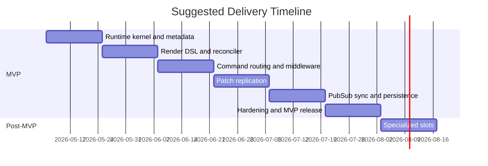

# Final PRD and Milestone Plan for a BEAM Hierarchical Store Runtime

## Executive Summary

This PRD recommends a page-scoped, server-authoritative runtime for Elixir in which one BEAM process owns a dynamic hierarchical store tree, routes commands to addressed child stores, rerenders the tree after state changes, reconciles keyed children, and emits JSON Patch operations to a client transport. The design deliberately borrows semantics from urlPhoenix.LiveViewturn0search4, urlPhoenix.LiveComponentturn0search0, urlPhoenix.Component and HEExturn0search21, urlPhoenix.PubSubturn0search2, urlPlug.Builderturn0search3, urltelemetryturn1search0, and urlRFC 6902 JSON Patchturn1search2. Phoenix documents LiveView as a process that receives events, updates state, and pushes diffs; LiveComponents have their own lifecycle inside the same process; HEEx provides attr declarations plus `:if` and `:for`; Plug provides ordered, halting pipelines; Phoenix.PubSub provides topic subscription and cluster broadcast; and Telemetry provides structured event emission and span semantics. citeturn9view1turn3view0turn3view4turn5view1turn6view0turn7view1turn2view5

The central architecture choice is **one runtime process per page connection, not one process per child store**. LiveView's process-per-view model and LiveComponent's same-process state-sharing make atomic command execution, a single reconciliation pass, one patch stream, and predictable ownership significantly simpler than a tree of cooperating processes. LiveComponent guidance also warns that component assigns are all kept in memory and should be passed narrowly, which strongly supports explicit `attrs` versus `local state` separation in this runtime. citeturn9view2turn3view0turn8view1

The MVP should include middleware, dynamic render-driven tree construction, attrs/local separation, parent-provided callbacks, command routing, JSON Patch replication, same-user PubSub synchronization, keyed reconciliation, lifecycle hooks, snapshot persistence adapters, telemetry, authorization, devtools hooks, and a reference client transport. It should explicitly exclude CRDTs, offline-first sync, event sourcing, multi-process child stores, and generalized UI composition. Specialized slot/subtree ownership is valuable for scope/boundary stores, but it should be experimental and postponed until after the core runtime is stable.

## Product Definition

### Product statement

The product is a runtime library for Elixir applications that lets developers model page state as a hierarchical tree of stateful stores. Each page runtime hosts the whole tree inside one GenServer-like process; child stores are logical runtime nodes, not standalone processes. The parent owns child lifecycle and passes immutable attrs downward; children maintain local state and communicate upward only through explicit callbacks or outward through controlled runtime effects such as PubSub broadcast.

### Goals

| Goal | Final decision |
|---|---|
| Single-process consistency | One runtime process per connected page/session |
| Dynamic hierarchy | Tree is produced by `render/1`, not static declarations |
| Explicit ownership | Parent passes attrs and callbacks; child owns only local state |
| Familiar DSL | HEEx-like syntax for store tags, `:if`, `:for`, and compile-time validation |
| Predictable side effects | Plug-like middleware with halting and ordered hooks |
| Addressable mutations | Commands route by node path plus command name |
| Efficient replication | JSON Patch over a duplex transport, with versioning and resync |
| Cross-runtime sync | Same-user topic broadcasts via Phoenix.PubSub |
| Recoverability | Snapshot persistence adapters, not event sourcing |
| Observability | Telemetry events, tree snapshots, trace hooks, patch history |

### Non-goals

| Non-goal | Reason |
|---|---|
| One process per child store | Too much ordering, mailbox, and merge complexity for MVP |
| CRDT/offline-first | Large complexity increase with no MVP necessity |
| Event sourcing | Snapshot persistence is enough for this runtime layer |
| Arbitrary slots and named slots | General composition is not required for MVP |
| Automatic cross-store mutation graphs | Blurs ownership and makes behavior hard to reason about |
| Full UI framework | This runtime renders a store tree, not DOM/HTML |
| Global selector graph/time travel | Useful later, but not required for first usable system |

The decision to keep one process per page is consistent with LiveView's process-per-view lifecycle and LiveComponent's own-state-within-parent-process model. The decision to keep attrs narrow and explicit is also consistent with LiveComponent guidance to avoid passing all assigns and to treat only necessary inputs as component assigns. citeturn9view2turn3view0turn8view1

## Architecture Overview

### Core runtime components

| Component | Responsibility |
|---|---|
| Page Runtime | Owns the root store tree, message loop, versioning, subscriptions, and transport session |
| Store Metadata Registry | Holds compile-time declarations for attrs, state fields, callbacks, commands, middleware, and slot capability |
| Render Compiler | Compiles HEEx-like `~LS` templates into virtual store nodes |
| Reconciler | Compares old and new virtual trees, computes mount/update/unmount actions, preserves keyed local state |
| Command Router | Resolves `{path, command}` to a node, validates payload, invokes middleware and handler |
| Middleware Runner | Executes ordered hooks around mount, command, reconcile, patch, and terminate |
| Diff Engine | Produces RFC 6902 JSON Patch ops from committed tree changes |
| Transport Adapter | Sends patches to the client and receives commands/acks |
| PubSub Bridge | Tracks topic subscriptions and routes broadcasts into the tree |
| Persistence Adapter | Loads and saves snapshot state for the runtime tree |
| Devtools/Trace | Exposes introspection, last command, last patch, timings, and tree shape |

### Data flow

**Command flow**

`client command -> payload validation -> before_command middleware -> handler -> root render -> reconcile -> patch generation -> after_command middleware -> transport push -> optional snapshot save`

**Broadcast flow**

`PubSub message -> runtime topic router -> target store handle_broadcast -> root render -> reconcile -> patch generation -> transport push`

**Recovery flow**

`runtime start -> optional snapshot load -> initial mount -> first render -> reconcile against restored snapshot identities -> subscribe topics -> ready`

LiveView's documented model of "state change -> rerender -> push diffs" and LiveComponent's documented "mount -> update -> render" lifecycle provide the right precedent here. The runtime differs by rendering a **store tree** rather than HTML, but its event loop and ownership semantics should remain equally simple. citeturn9view1turn3view0

### Transport and patching

The wire format should be transport-agnostic, with a reference WebSocket adapter for MVP. All client-visible updates should be versioned and emitted as RFC 6902 JSON Patch arrays. JSON Patch is explicitly defined as an ordered array of operations over JSON documents, and LiveView's own documented model is diff-based updates from server state to the client. For MVP, the runtime should generate only `add`, `remove`, and `replace`; `move`, `copy`, and `test` can remain out of scope. citeturn2view5turn9view1

Example wire envelopes:

```json
{
  "type": "command",
  "path": ["cart"],
  "command": "add_item",
  "payload": {"sku": "ABC-123", "qty": 1},
  "client_seq": 17
}
```

```json
{
  "type": "patch",
  "base_version": 41,
  "version": 42,
  "ops": [
    {"op": "replace", "path": "/children/cart/local/item_count", "value": 3}
  ]
}
```

If the client misses a patch or version check fails, the runtime should send a **full snapshot replace** for the affected subtree or the whole page. That is the designated rollback path for replication failures in MVP.

## Programming Model and API

The programming model should feel familiar to Phoenix developers: explicit attrs like `Phoenix.Component.attr/3`, parent-driven updates like `Phoenix.LiveComponent.update/2`, HEEx-like control flow with `<%= if %>`, `<%= for %>`, `:if`, and `:for`, and compile-time validation wherever static information is available. Phoenix documents compile-time warnings for required and unknown attrs and slots, and HEEx adds structural validation plus shorthand `:if` and `:for`; this runtime should reuse that developer ergonomics model, even if its compiler implementation is a constrained subset rather than a direct reuse of Phoenix internals. citeturn4view0turn10view2turn10view0turn3view4

### API surface

| Surface | Purpose | Final rule |
|---|---|---|
| `use LiveStore` | Marks a module as a store | Required |
| `attr name, type, opts` | Declares parent-provided attrs | Required for all external inputs |
| `state do ... end` | Declares local state fields | Stores own only this mutable state |
| `callback name, opts` | Declares parent-provided upward capability | Runtime-validates presence and arity |
| `command name do ... end` | Declares command schema | Runtime-validates payload |
| `middleware ...` | Attaches middleware modules | Root and/or store-local |
| `mount(attrs, ctx)` | Initializes local state on first insertion | Called once per ownership identity |
| `update(attrs, local, ctx)` | Responds to attr/callback changes | Called on meaningful input change |
| `handle_command(name, payload, local, ctx)` | Handles addressed client command | Returns new local state plus optional effects |
| `handle_broadcast(topic, event, payload, local, ctx)` | Applies external broadcast changes | Optional |
| `render(assigns)` | Declares child store tree | Required for non-leaf stores |
| `slot :inner_block` | Opts into specialized subtree ownership | Experimental, post-MVP |

### Store example

```elixir
defmodule CheckoutStore do
  use LiveStore

  attr :cart, :map, required: true
  attr :current_user, :map, required: true

  state do
    field :loading, :boolean, default: false
    field :error, :string, default: nil
  end

  callback :on_checkout, payload: :map, required: true

  command :submit_checkout do
    payload :payment_method_id, :string, required: true
  end

  middleware LiveStore.Middleware.Logger
  middleware {LiveStore.Middleware.Authorize, ability: :checkout}

  def mount(_attrs, _ctx), do: {:ok, %{loading: false, error: nil}}

  def update(_attrs, local, _ctx), do: {:ok, local}

  def handle_command(:submit_checkout, %{payment_method_id: pm_id}, local, _ctx) do
    {:ok, %{local | loading: true},
     effects: [callback: {:on_checkout, %{payment_method_id: pm_id}}]}
  end

  def render(assigns) do
    ~LS"""
    <PaymentStore id="payment" cart={@cart} />
    <SummaryStore id="summary" cart={@cart} loading={@loading} />
    """
  end
end
```

### Render DSL example

```elixir
def render(assigns) do
  ~LS"""
  <CartStore id="cart" cart={@cart} on_checkout={@on_checkout} />

  <NotificationStore
    :if={@show_notifications}
    id="notifications"
    current_user={@current_user}
  />

  <LineItemStore
    :for={item <- @items}
    id={item.id}
    item={item}
    on_remove={@on_remove_item}
  />
  """
end
```

The runtime storage model must keep `attrs` and `local state` separate even if the render context flattens both into read-only assigns for ergonomics. Name collisions between an attr and a local field should be a compile-time error. That preserves clear ownership while still giving developers straightforward render syntax.

### Command return contract

`handle_command/4` should return one of:

```elixir
{:ok, local}
{:ok, local, effects: [...]}
{:error, reason}
```

Supported MVP effects:

- `{:callback, name, payload}`
- `{:broadcast, topic, event, payload}`
- `{:reply, payload}`
- `{:persist_now}`

This keeps side effects visible to middleware, telemetry, and tests.

### Middleware API and examples

The middleware model should be runtime Plug-like: ordered, halting, and explicit. Plug documents top-to-bottom execution and halting semantics; those are the right defaults here, except the hooks operate on store runtime context instead of `Plug.Conn`. citeturn6view0turn6view1turn6view3

```elixir
defmodule LiveStore.Middleware do
  @callback init(opts) :: opts

  @callback before_mount(attrs, ctx) ::
              {:cont, attrs, ctx} | {:halt, term}

  @callback before_command(path, command, payload, ctx) ::
              {:cont, payload, ctx} | {:halt, term}

  @callback after_command(path, command, old_tree, new_tree, patch, ctx) ::
              {:cont, patch, ctx} | {:halt, term}

  @callback terminate(reason, runtime, ctx) :: :ok
end
```

```elixir
defmodule LiveStore.Middleware.Logger do
  @behaviour LiveStore.Middleware

  def init(opts), do: opts

  def before_command(path, command, payload, ctx) do
    Logger.info("[live_store] #{inspect(path)} #{command} user=#{ctx.current_user_id}")
    {:cont, payload, ctx}
  end

  def after_command(_path, _command, _old, _new, patch, ctx) do
    Logger.debug("[live_store] patch_ops=#{length(patch)} page=#{ctx.page_id}")
    {:cont, patch, ctx}
  end

  def terminate(_reason, _runtime, _ctx), do: :ok
end
```

```elixir
defmodule LiveStore.Middleware.Authorize do
  @behaviour LiveStore.Middleware

  def init(opts), do: opts

  def before_command(path, command, payload, ctx) do
    if MyPolicy.allow?(ctx.current_user, command.ability, path) do
      {:cont, payload, ctx}
    else
      {:halt, {:error, :unauthorized}}
    end
  end

  def terminate(_reason, _runtime, _ctx), do: :ok
end
```

## Runtime Semantics and Operations

### State ownership and lifecycle

A store node is identified by **owner path + module + id**. That is a deliberate constraint: within one owner, keyed reordering preserves local state; moving a node to a different owner remounts it. This is slightly stricter than LiveComponent's documented "same module + id anywhere in the page is the same component," but it is the correct trade-off here because ownership boundaries matter for callbacks, middleware, and specialized slots. LiveComponent docs also establish the lifecycle precedent: `mount` once, then `update`, then `render`; callbacks should be parent-provided so the parent retains explicit control over the messages or effects it accepts. citeturn3view0turn3view2turn8view2

Lifecycle rules:

- `mount(attrs, ctx)` runs when a node identity first appears.
- `update(attrs, local, ctx)` runs when attrs or callbacks change meaningfully.
- `render(assigns)` runs after mount, after update, and after successful command/broadcast handling.
- `unmount(reason, local, ctx)` runs when a node disappears from its owner.
- Root `terminate(reason, runtime)` runs when the page runtime exits.
- Children **cannot** mutate parent or siblings directly.

### Reconciliation and keyed lists

Reconciliation is root-driven. After a successful command or broadcast, the runtime rerenders the tree from the root and compares virtual nodes against the previous tree. Existing nodes with the same `(owner_path, module, id)` keep their local state; new identities mount; removed identities unmount. For keyed lists, an explicit stable `id` is mandatory inside `:for`, and missing keys must be a compile-time or runtime error. This follows the same design pressure reflected in LiveComponent identity rules and in `update_many/1`, which Phoenix documents as a breadth-first update optimization for many nested components. The runtime should preserve room for a future `update_many`-like optimization, but it is not required for MVP. citeturn3view0turn3view1

Reconciliation rules for MVP:

- Preserve node state **only** across reorders under the same owner.
- Remount on module change, owner change, or missing key.
- Diff child arrays by keyed identity; never by index alone.
- Emit JSON Patch `add`/`remove`/`replace` ops only.
- Allow subtree-level `replace` as the safe fallback when a minimal diff is not worth the complexity.

### Slot semantics and constraints

Phoenix.Component documents default and named slots, and LiveComponent also accepts slots. That is the right inspiration, but the store runtime should **not** treat slots as general presentation composition. In this runtime, a slot means **subtree ownership transfer** to a specialized boundary store. Therefore, slot support should be constrained to a single default slot in post-MVP, with no named slots and no slot attrs in MVP. citeturn4view1turn10view1turn8view2

Example:

```elixir
def render(assigns) do
  ~LS"""
  <DraftScopeStore id="draft" draft_id={@draft_id}>
    <TemplateStore id="template" />
    <TargetingStore id="targeting" />
  </DraftScopeStore>
  """
end
```

Final slot rules:

- Disabled in MVP GA; shipped later behind an experimental flag.
- One default slot only.
- Only stores declaring slot capability may receive subtree children.
- Moving a node into or out of a slot remounts it.
- No named slots, no slot attrs, no arbitrary layout composition in MVP.
- Intended only for scope/boundary stores such as `DraftScopeStore`, `AsyncBoundaryStore`, or `ResourceScopeStore`.

### PubSub model and persistence

Phoenix.PubSub provides exactly the topic subscription and cluster broadcast model needed for cross-page or cross-tab same-user sync. The runtime should subscribe **once per topic per page process**, because Phoenix.PubSub explicitly warns that duplicate subscriptions result in duplicate events. For same-user sync, use topics like `user:<id>`; the runtime can also optionally support resource topics later. Use `broadcast_from` where the origin runtime has already applied the change and local echo is unnecessary, since Phoenix.PubSub documents that the default dispatcher excludes the initiating process for `broadcast_from`. citeturn5view0turn5view1turn5view2

Suggested internal broadcast shape:

```elixir
%LiveStore.Broadcast{
  topic: "user:123",
  event: "notifications.updated",
  payload: %{count: 5},
  origin_page_id: "page_abc123"
}
```

Suggested store effect:

```elixir
{:ok, local,
 effects: [broadcast: {"user:#{ctx.current_user.id}", "notifications.updated", %{count: 5}}]}
```

Snapshot persistence is the correct persistence model for MVP. The persistence unit should be the **whole page runtime tree snapshot**, not a per-command event log. On restore, the runtime should load the saved tree and seed local state for matching identities during the first reconcile; unmatched nodes fresh-mount, and stale nodes are dropped. Recommended adapters:

- `ETS` for dev/test and single-node ephemeral use
- `Redis` for shared ephemeral state
- `Postgres` for durable JSON snapshot storage

Recommended persistence adapter behaviour:

```elixir
defmodule LiveStore.Persistence do
  @callback load(key, meta) ::
              {:ok, snapshot} | :not_found | {:error, term}

  @callback save(key, snapshot, meta) ::
              :ok | {:error, term}

  @callback delete(key, meta) ::
              :ok | {:error, term}
end
```

Default persistence mode should be **debounced, post-commit snapshot save** so command latency is not dominated by storage I/O. Synchronous durability can remain an opt-in adapter/middleware mode.

### Telemetry, security, devtools, and testing

Telemetry is a first-class requirement. The Telemetry docs define `execute/3`, handler attachment, and `span/3` start/stop/exception semantics; the runtime should instrument command handling, render, reconcile, patch emission, persistence, and PubSub receive/broadcast with those conventions. citeturn2view4turn7view1

Recommended telemetry events:

| Event prefix | Measurements | Metadata |
|---|---|---|
| `[:live_store, :mount, :start|:stop|:exception]` | duration | page_id, root_module |
| `[:live_store, :command, :start|:stop|:exception]` | duration, patch_ops | page_id, path, command, user_id |
| `[:live_store, :render, :stop]` | duration, node_count | page_id |
| `[:live_store, :reconcile, :stop]` | duration, mounts, updates, unmounts | page_id |
| `[:live_store, :patch, :stop]` | duration, op_count, bytes | page_id |
| `[:live_store, :persistence, :save, :stop|:exception]` | duration, bytes | key, adapter |
| `[:live_store, :pubsub, :receive]` | count | topic, event |
| `[:live_store, :auth, :deny]` | count | path, command, user_id |

Security and authorization should be middleware-driven and default-deny. Command payloads are network inputs and must always be runtime-validated against the declared `command` schema before handler execution. Authorization runs in `before_command` middleware and may halt the pipeline exactly like a Plug halt. Callbacks are capabilities: if the parent does not pass a callback, the child cannot invoke it. PubSub messages must be scoped by topic authority, and the runtime must reject broadcasts that do not belong to the current subscription set. Plug's documented sequential and halting pipeline model is the right precedent for this. citeturn6view1turn6view3

Devtools should expose:

- `LiveStore.Dev.snapshot(pid)` for current tree, node paths, attrs/local sizes, subscriptions, and version
- `LiveStore.Dev.last_patch(pid)` for last patch envelope
- `LiveStore.Dev.trace(pid, on: true)` for command and lifecycle tracing
- a ring buffer of recent commands, broadcast receipts, and persistence failures
- middleware timing breakdowns via telemetry

Testing should be layered:

- **Unit tests** for `mount`, `update`, `handle_command`, `handle_broadcast`
- **Reconciler tests** for keyed reorder, remount on owner change, and subtree deletes
- **Golden patch tests** for RFC 6902 output
- **Integration tests** with two page runtimes to verify same-user PubSub sync
- **Persistence round-trip tests** for snapshot restore
- **Failure tests** for unauthorized commands, middleware halts, stale command paths, and patch version mismatch resync

## Delivery Roadmap

The roadmap should prioritize the core page runtime and reconciliation loop first, then command and middleware semantics, then replication and operational features. Specialized slots should remain outside the MVP cutoff.

### Milestones

| Milestone | Deliverables | Effort | Success criteria | Timeline |
|---|---|---|---|---|
| Runtime kernel and metadata | Root runtime process, `use LiveStore`, metadata registry, `attr/state/callback/command` declarations, context struct | High | A root store can mount, hold local state, and execute a no-op command cycle without crashing | Weeks 1–2 |
| Render DSL and reconciler | `~LS` parser/compiler, virtual store nodes, keyed reconciliation, mount/update/unmount lifecycle | High | Static tree, conditional tree, and keyed list reorder all reconcile correctly; reorders preserve local state under same owner | Weeks 3–4 |
| Command routing and middleware | Path-based routing, payload validation, Plug-like middleware hooks, authorization middleware, callback effects | High | Commands route to correct node, unauthorized commands halt cleanly, callbacks execute only when declared/provided | Weeks 5–6 |
| Patch replication | JSON Patch diff engine, patch envelopes, versioning, resync path, reference WebSocket client adapter | High | Client receives and applies patches; version gaps trigger subtree/full resync; patch output passes golden tests | Weeks 7–8 |
| PubSub sync and persistence | Topic diff/subscription manager, same-user broadcast bridge, snapshot adapter behaviour, ETS + Postgres adapters | Medium | Two runtimes for the same user stay in sync; restored snapshots reconcile into current tree correctly | Weeks 9–10 |
| Hardening and MVP release | Telemetry, devtools hooks, trace buffer, docs, examples, benchmarks, failure recovery | Medium | MVP acceptance criteria all pass; instrumentation present; benchmark envelope is acceptable for target page size | Weeks 11–12 |
| Specialized slots | Default-slot subtree ownership, boundary-store semantics, docs and examples | Medium | Boundary stores can own a subtree without breaking core reconciliation and callback ownership rules | Weeks 13–14 |

### Suggested timeline



### Short implementation checklist

- Define core structs: `Runtime`, `Node`, `VNode`, `Context`, `PatchEnvelope`
- Implement store metadata macros and compile-time reflection
- Implement `~LS` compiler with `:if`, `:for`, and store tags
- Build reconciler with owner-scoped identity and lifecycle hooks
- Implement command router, schema validation, and callback/effect execution
- Add middleware runner with halting semantics
- Implement JSON Patch generation and transport versioning
- Add Phoenix.PubSub subscription diffing and same-user broadcast routing
- Add snapshot persistence adapters and restore reconciliation
- Add telemetry, devtools, tests, docs, and example application

## Acceptance Criteria, Risks, and Mitigations

### MVP acceptance criteria

The MVP is done when all of the following are true:

- A connected page runs as exactly one runtime process.
- A store can declare attrs, state, callbacks, commands, and middleware.
- Parents can pass attrs and callbacks to children; children can only change local state directly.
- A root `render/1` can produce static, conditional, and keyed list trees.
- Reordering a keyed sibling list preserves local state under the same owner.
- Command routing by `{path, command}` works for nested stores.
- Successful commands emit deterministic JSON Patch envelopes with monotonic versions.
- Two runtimes for the same user sync through PubSub without duplicate reprocessing.
- Snapshot persistence can restore a runtime tree after restart.
- Authorization middleware can halt commands cleanly.
- Telemetry and devtools expose mount, command, reconcile, patch, broadcast, and persistence visibility.
- The system runs without CRDTs, offline sync, or event sourcing.

### Key risks and trade-offs

| Risk | Trade-off | Mitigation and rollback |
|---|---|---|
| HEEx-like compiler is harder than expected | Familiar syntax is valuable, but parser/compiler work is real | Keep syntax-compatible goals, but allow an internal constrained implementation; if needed, ship a narrower `~LS` subset first |
| Minimal diff generation becomes expensive on big lists | Fine-grained patching may cost more than subtree replace | Permit subtree `replace` fallback in MVP; optimize keyed child diff later |
| Single-process page may become a hotspot | Simplifies correctness, but all child work shares one mailbox and heap | Keep page scope bounded, instrument mailbox/heap, and avoid per-child processes in MVP |
| Snapshot save adds latency or loses recent state | Sync save hurts UX; async save risks a small durability gap | Default to debounced async save; offer opt-in sync persistence mode for critical flows |
| PubSub feedback loops or duplicate events | Cross-runtime sync is easy to misconfigure | Use `broadcast_from`, include `origin_page_id`, subscribe once per topic, and drop self-origin echoes |
| Slot semantics blur ownership | Powerful boundary stores can complicate reconciliation | Ship slots after MVP, default slot only, remount on owner transfer, no named slots |
| DSL/runtime feature creep | Easy to drift into building a new UI framework | Keep non-goals explicit: no generic layout system, no CRDT, no event log, no child processes |

### Rollback strategy

If a late-stage feature jeopardizes the schedule, the fallback order should be:

- **First rollback:** ship MVP **without slots**
- **Second rollback:** downgrade from minimal patching to subtree `replace` patching
- **Third rollback:** ship only `ETS` and `Postgres` persistence adapters, defer Redis
- **Fourth rollback:** ship a narrower `~LS` syntax subset, keeping the same public store declarations
- **Never rollback:** single-process ownership model, attrs/local separation, command routing, middleware, PubSub same-user sync, or telemetry instrumentation
