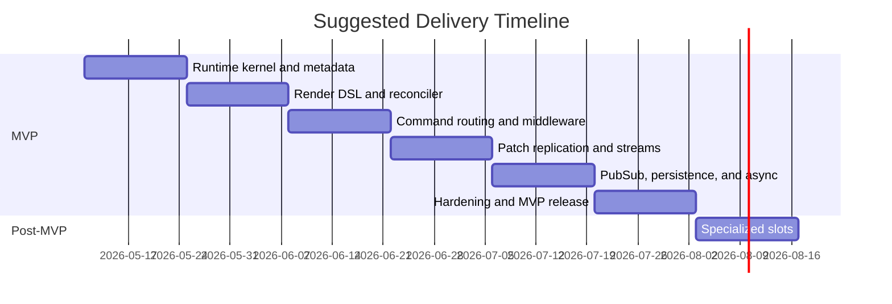

# Final PRD and Milestone Plan for a BEAM Hierarchical Store Runtime

## Executive Summary

This PRD recommends a page-scoped, server-authoritative runtime for Elixir in which one BEAM process owns a dynamic hierarchical store tree, routes commands to addressed child stores, rerenders the tree after state changes, reconciles keyed children, and emits JSON Patch operations to a client transport. The design deliberately borrows semantics from urlPhoenix.LiveViewturn0search4, urlPhoenix.LiveComponentturn0search0, urlPhoenix.Component and HEExturn0search21, urlPhoenix.PubSubturn0search2, urlPlug.Builderturn0search3, urltelemetryturn1search0, and urlRFC 6902 JSON Patchturn1search2. Phoenix documents LiveView as a process that receives events, updates state, and pushes diffs; LiveComponents have their own lifecycle inside the same process; HEEx provides attr declarations plus `:if` and `:for`; Plug provides ordered, halting pipelines; Phoenix.PubSub provides topic subscription and cluster broadcast; and Telemetry provides structured event emission and span semantics. citeturn9view1turn3view0turn3view4turn5view1turn6view0turn7view1turn2view5

The central architecture choice is **one runtime process per page connection, not one process per child store**. LiveView's process-per-view model and LiveComponent's same-process state-sharing make atomic command execution, a single reconciliation pass, one patch stream, and predictable ownership significantly simpler than a tree of cooperating processes. LiveComponent guidance also warns that component assigns are all kept in memory and should be passed narrowly, which strongly supports explicit `attrs` versus `local state` separation in this runtime. citeturn9view2turn3view0turn8view1

The MVP should include middleware, dynamic render-driven tree construction, attrs/local separation, parent-provided callbacks, command routing, JSON Patch replication, same-user PubSub synchronization, keyed reconciliation, lifecycle hooks, snapshot persistence adapters, telemetry, authorization, devtools hooks, a reference client transport, **LiveView-parity stream support** (server holds dom_id index only, client owns values; full op set: `stream/4`, `stream_configure/3`, `stream_insert/4`, `stream_delete/3`, `stream_delete_by_dom_id/3`), and **LiveView-parity async tasks** (`assign_async/3,4`, `start_async/3,4`, `cancel_async/2,3`, `handle_async/4`, `Arbor.AsyncResult`). It should explicitly exclude CRDTs, offline-first sync, event sourcing, multi-process child stores, and generalized UI composition. Specialized slot/subtree ownership is valuable for scope/boundary stores, but it should be experimental and postponed until after the core runtime is stable.

## Product Definition

### Product statement

The product is a runtime library for Elixir applications that lets developers model page state as a hierarchical tree of stateful stores. Each page runtime hosts the whole tree inside one GenServer-like process; child stores are logical runtime nodes, not standalone processes. The parent owns child lifecycle and passes immutable attrs downward; children maintain local state and communicate upward only through explicit callbacks or outward through controlled runtime effects such as PubSub broadcast.

### Goals

| Goal | Final decision |
|---|---|
| Single-process consistency | One runtime process per connected page/session |
| Dynamic hierarchy | Tree is produced by `render/1`, not static declarations |
| Explicit ownership | Parent passes attrs and callbacks; child owns only local state |
| Familiar DSL | HEEx-like syntax for store tags, `:if`, `:for`, and compile-time validation |
| Predictable side effects | Plug-like middleware with halting and ordered hooks |
| Addressable mutations | Commands route by node path plus command name |
| Efficient replication | JSON Patch over a duplex transport, with versioning and resync |
| Stream support | LiveView-parity stream API; server holds dom_id index only, client owns values |
| Async tasks | LiveView-parity `assign_async`/`start_async`/`cancel_async` with `AsyncResult` lifecycle |
| Cross-runtime sync | Same-user topic broadcasts via Phoenix.PubSub |
| Recoverability | Snapshot persistence adapters, not event sourcing |
| Observability | Telemetry events, tree snapshots, trace hooks, patch history |

### Non-goals

| Non-goal | Reason |
|---|---|
| One process per child store | Too much ordering, mailbox, and merge complexity for MVP |
| CRDT/offline-first | Large complexity increase with no MVP necessity |
| Event sourcing | Snapshot persistence is enough for this runtime layer |
| Arbitrary slots and named slots | General composition is not required for MVP |
| Automatic cross-store mutation graphs | Blurs ownership and makes behavior hard to reason about |
| Full UI framework | This runtime renders a store tree, not DOM/HTML |
| Global selector graph/time travel | Useful later, but not required for first usable system |
| Server-replayable stream history | Stream values are forgotten by design; resync uses `reload_stream/2` callback or full snapshot replace |
| Async result persistence by default | Loading/failed states do not survive restart; only `ok?` results may opt in via `persist: :ok_only` |

The decision to keep one process per page is consistent with LiveView's process-per-view lifecycle and LiveComponent's own-state-within-parent-process model. The decision to keep attrs narrow and explicit is also consistent with LiveComponent guidance to avoid passing all assigns and to treat only necessary inputs as component assigns. citeturn9view2turn3view0turn8view1

## Architecture Overview

### Core runtime components

| Component | Responsibility |
|---|---|
| Page Runtime | Owns the root store tree, message loop, versioning, subscriptions, and transport session |
| Store Metadata Registry | Holds compile-time declarations for attrs, state fields, callbacks, commands, middleware, streams, async tasks, and slot capability |
| Render Compiler | Compiles HEEx-like `~LS` templates into virtual store nodes |
| Reconciler | Compares old and new virtual trees, computes mount/update/unmount actions, preserves keyed local state |
| Command Router | Resolves `{path, command}` to a node, validates payload, invokes middleware and handler |
| Middleware Runner | Executes ordered hooks around mount, command, reconcile, patch, and terminate |
| Diff Engine | Produces RFC 6902 JSON Patch ops from committed tree changes |
| Stream Manager | Tracks per-store stream config and dom_id key sets, accumulates `stream_ops` per command/broadcast cycle, drops values after flush |
| Async Supervisor | Runtime-scoped `Task.Supervisor`; tracks refs, routes `{ref, result}` and `{:DOWN, ...}` to `handle_async/4` or `assign_async` updaters; cancels on unmount |
| Transport Adapter | Sends patches to the client and receives commands/acks |
| PubSub Bridge | Tracks topic subscriptions and routes broadcasts into the tree |
| Persistence Adapter | Loads and saves snapshot state for the runtime tree |
| Devtools/Trace | Exposes introspection, last command, last patch, timings, tree shape, active async refs, and stream counters |

### Data flow

**Command flow**

`client command -> payload validation -> before_command middleware -> handler -> root render -> reconcile -> patch generation (json_patch ops + stream_ops) -> after_command middleware -> transport push -> optional snapshot save`

**Broadcast flow**

`PubSub message -> runtime topic router -> target store handle_broadcast -> root render -> reconcile -> patch generation -> transport push`

**Async flow**

`handler calls assign_async/start_async -> Task spawned under Async Supervisor -> immediate flush of loading-state patch -> task completes -> runtime mailbox receives {ref, result} -> route to assign_async writer or handle_async/4 -> reconcile -> patch generation -> transport push`

**Stream flow**

`handler calls stream/stream_insert/stream_delete -> ops accumulated in Stream Manager -> reconcile finalizes other state -> patch envelope packs stream_ops alongside json_patch ops -> transport push -> server drops op data, retains dom_id index only`

**Recovery flow**

`runtime start -> optional snapshot load -> initial mount -> first render -> reconcile against restored snapshot identities -> async tasks restarted by mount as needed -> stream re-seeding via mount or reload_stream/2 -> subscribe topics -> ready`

LiveView's documented model of "state change -> rerender -> push diffs" and LiveComponent's documented "mount -> update -> render" lifecycle provide the right precedent here. The runtime differs by rendering a **store tree** rather than HTML, but its event loop and ownership semantics should remain equally simple. citeturn9view1turn3view0

### Transport and patching

The wire format should be transport-agnostic, with a reference WebSocket adapter for MVP. All client-visible updates should be versioned and emitted as RFC 6902 JSON Patch arrays alongside an ordered `stream_ops` list. JSON Patch is explicitly defined as an ordered array of operations over JSON documents, and LiveView's own documented model is diff-based updates from server state to the client. For MVP, the runtime should generate only `add`, `remove`, and `replace` JSON Patch ops; `move`, `copy`, and `test` remain out of scope. citeturn2view5turn9view1

Example wire envelopes:

```json
{
  "type": "command",
  "path": ["cart"],
  "command": "add_item",
  "payload": {"sku": "ABC-123", "qty": 1},
  "client_seq": 17
}
```

```json
{
  "type": "patch",
  "base_version": 41,
  "version": 42,
  "ops": [
    {"op": "replace", "path": "/children/cart/local/item_count", "value": 3}
  ],
  "stream_ops": []
}
```

```json
{
  "type": "patch",
  "base_version": 42,
  "version": 43,
  "ops": [],
  "stream_ops": [
    {"op": "configure", "path": ["chat"], "stream": "messages", "dom_id_prefix": "msg-"},
    {"op": "reset",     "path": ["chat"], "stream": "messages"},
    {"op": "insert",    "path": ["chat"], "stream": "messages",
     "dom_id": "msg-7", "at": 0, "limit": -100, "data": {"id": 7, "body": "hi"}},
    {"op": "delete",    "path": ["chat"], "stream": "messages", "dom_id": "msg-3"}
  ]
}
```

```json
{
  "type": "command",
  "path": ["chat"],
  "command": "request_stream_reload",
  "payload": {"stream": "messages"},
  "client_seq": 91
}
```

If the client misses a patch or version check fails, the runtime should send a **full snapshot replace** for the affected subtree or the whole page; for streams, the runtime invokes the optional `reload_stream/2` callback to re-seed, otherwise falls back to subtree replace. That is the designated rollback path for replication failures in MVP.

## Programming Model and API

The programming model should feel familiar to Phoenix developers: explicit attrs like `Phoenix.Component.attr/3`, parent-driven updates like `Phoenix.LiveComponent.update/2`, HEEx-like control flow with `<%= if %>`, `<%= for %>`, `:if`, and `:for`, and compile-time validation wherever static information is available. Phoenix documents compile-time warnings for required and unknown attrs and slots, and HEEx adds structural validation plus shorthand `:if` and `:for`; this runtime should reuse that developer ergonomics model, even if its compiler implementation is a constrained subset rather than a direct reuse of Phoenix internals. citeturn4view0turn10view2turn10view0turn3view4

### API surface

| Surface | Purpose | Final rule |
|---|---|---|
| `use Arbor.Store` | Marks a module as a store | Required |
| `attr name, type, opts` | Declares parent-provided attrs | Required for all external inputs |
| `state do ... end` | Declares local state fields | Stores own only this mutable state |
| `callback name, opts` | Declares parent-provided upward capability | Runtime-validates presence and arity |
| `command name do ... end` | Declares command schema | Runtime-validates payload |
| `middleware ...` | Attaches middleware modules | Root and/or store-local |
| `stream name, opts` | Declares stream metadata (`:dom_id`, `:limit`) | Compile-time fixed; values not persisted |
| `async name, opts` | Declares named async task slot | Optional sugar over `start_async/3,4` |
| `mount(attrs, ctx)` | Initializes local state on first insertion | Called once per ownership identity |
| `update(attrs, local, ctx)` | Responds to attr/callback changes | Called on meaningful input change |
| `handle_command(name, payload, local, ctx)` | Handles addressed client command | Returns new local state plus optional effects |
| `handle_broadcast(topic, event, payload, local, ctx)` | Applies external broadcast changes | Optional |
| `handle_async(name, result, local, ctx)` | Receives async task completion | Required when `start_async` is used |
| `reload_stream(name, ctx)` | Re-seeds a stream during resync | Optional; required for stream resync without full subtree replace |
| `stream/4`, `stream_configure/3`, `stream_insert/4`, `stream_delete/3`, `stream_delete_by_dom_id/3` | Imperative stream API on `ctx` | Mirrors `Phoenix.LiveView` semantics |
| `assign_async(ctx, key_or_keys, fun, opts)` | Spawns task; result wraps as `AsyncResult` in local | Auto loading/ok/failed; `:reset`, `:timeout`, `:supervisor` |
| `start_async(ctx, name, fun, opts)` | Spawns named task; result routes to `handle_async/4` | `:timeout`, `:supervisor` |
| `cancel_async(ctx, name_or_key, reason)` | Cancels a running async task | Auto on unmount; manual on demand |
| `render(assigns)` | Declares child store tree | Required for non-leaf stores |
| `slot :inner_block` | Opts into specialized subtree ownership | Experimental, post-MVP |

### Store example

```elixir
defmodule CheckoutStore do
  use Arbor.Store

  attr :cart, :map, required: true
  attr :current_user, :map, required: true

  state do
    field :loading, :boolean, default: false
    field :error, :string, default: nil
  end

  callback :on_checkout, payload: :map, required: true

  command :submit_checkout do
    payload :payment_method_id, :string, required: true
  end

  middleware Arbor.Middleware.Logger
  middleware {Arbor.Middleware.Authorize, ability: :checkout}

  def mount(_attrs, _ctx), do: {:ok, %{loading: false, error: nil}}

  def update(_attrs, local, _ctx), do: {:ok, local}

  def handle_command(:submit_checkout, %{payment_method_id: pm_id}, local, _ctx) do
    {:ok, %{local | loading: true},
     effects: [callback: {:on_checkout, %{payment_method_id: pm_id}}]}
  end

  def render(assigns) do
    ~LS"""
    <PaymentStore id="payment" cart={@cart} />
    <SummaryStore id="summary" cart={@cart} loading={@loading} />
    """
  end
end
```

### Render DSL example

```elixir
def render(assigns) do
  ~LS"""
  <CartStore id="cart" cart={@cart} on_checkout={@on_checkout} />

  <NotificationStore
    :if={@show_notifications}
    id="notifications"
    current_user={@current_user}
  />

  <LineItemStore
    :for={item <- @items}
    id={item.id}
    item={item}
    on_remove={@on_remove_item}
  />

  <MessageList
    id="messages"
    :stream={@streams.messages}
  />

  <UserProfile
    id="profile"
    profile={@profile}
  />
  """
end
```

The runtime storage model must keep `attrs` and `local state` separate even if the render context flattens both into read-only assigns for ergonomics. Name collisions between an attr and a local field should be a compile-time error. That preserves clear ownership while still giving developers straightforward render syntax. Streams expose their accumulated ops via `@streams.<name>`; on first render, this enumerates seeded items, and on subsequent renders it enumerates only pending ops for that cycle. `AsyncResult` values are first-class local state: they serialize through JSON Patch like any other field and remain readable in render via `@assign_name`.

### Command return contract

`handle_command/4` should return one of:

```elixir
{:ok, local}
{:ok, local, ctx}
{:ok, local, effects: [...]}
{:ok, local, ctx, effects: [...]}
{:error, reason}
```

Returning a `ctx` allows handlers to chain stream and async API calls (`stream_insert`, `assign_async`, `cancel_async`, etc.) prior to flush. Supported MVP effects:

- `{:callback, name, payload}`
- `{:broadcast, topic, event, payload}`
- `{:reply, payload}`
- `{:persist_now}`

Stream and async APIs are **not** effects: they are direct transformations on `ctx` so they can be composed and observed by middleware via the updated context. This keeps side effects visible to middleware, telemetry, and tests.

### Middleware API and examples

The middleware model should be runtime Plug-like: ordered, halting, and explicit. Plug documents top-to-bottom execution and halting semantics; those are the right defaults here, except the hooks operate on store runtime context instead of `Plug.Conn`. citeturn6view0turn6view1turn6view3

```elixir
defmodule Arbor.Middleware do
  @callback init(opts) :: opts

  @callback before_mount(attrs, ctx) ::
              {:cont, attrs, ctx} | {:halt, term}

  @callback before_command(path, command, payload, ctx) ::
              {:cont, payload, ctx} | {:halt, term}

  @callback after_command(path, command, old_tree, new_tree, patch, ctx) ::
              {:cont, patch, ctx} | {:halt, term}

  @callback terminate(reason, runtime, ctx) :: :ok
end
```

```elixir
defmodule Arbor.Middleware.Logger do
  @behaviour Arbor.Middleware

  def init(opts), do: opts

  def before_command(path, command, payload, ctx) do
    Logger.info("[arbor] #{inspect(path)} #{command} user=#{ctx.current_user_id}")
    {:cont, payload, ctx}
  end

  def after_command(_path, _command, _old, _new, patch, ctx) do
    Logger.debug("[arbor] patch_ops=#{length(patch.ops)} stream_ops=#{length(patch.stream_ops)} page=#{ctx.page_id}")
    {:cont, patch, ctx}
  end

  def terminate(_reason, _runtime, _ctx), do: :ok
end
```

```elixir
defmodule Arbor.Middleware.Authorize do
  @behaviour Arbor.Middleware

  def init(opts), do: opts

  def before_command(path, command, payload, ctx) do
    if MyPolicy.allow?(ctx.current_user, command.ability, path) do
      {:cont, payload, ctx}
    else
      {:halt, {:error, :unauthorized}}
    end
  end

  def terminate(_reason, _runtime, _ctx), do: :ok
end
```

## Runtime Semantics and Operations

### State ownership and lifecycle

A store node is identified by **owner path + module + id**. That is a deliberate constraint: within one owner, keyed reordering preserves local state; moving a node to a different owner remounts it. This is slightly stricter than LiveComponent's documented "same module + id anywhere in the page is the same component," but it is the correct trade-off here because ownership boundaries matter for callbacks, middleware, and specialized slots. LiveComponent docs also establish the lifecycle precedent: `mount` once, then `update`, then `render`; callbacks should be parent-provided so the parent retains explicit control over the messages or effects it accepts. citeturn3view0turn3view2turn8view2

Lifecycle rules:

- `mount(attrs, ctx)` runs when a node identity first appears.
- `update(attrs, local, ctx)` runs when attrs or callbacks change meaningfully.
- `render(assigns)` runs after mount, after update, and after successful command/broadcast/async/stream handling.
- `unmount(reason, local, ctx)` runs when a node disappears from its owner. All async tasks owned by the node are cancelled with reason `{:exit, :unmount}`. The node's stream dom_id index is dropped.
- Root `terminate(reason, runtime)` runs when the page runtime exits. The Async Supervisor terminates all child tasks.
- Children **cannot** mutate parent or siblings directly.

### Reconciliation and keyed lists

Reconciliation is root-driven. After a successful command, broadcast, or async result, the runtime rerenders the tree from the root and compares virtual nodes against the previous tree. Existing nodes with the same `(owner_path, module, id)` keep their local state; new identities mount; removed identities unmount. For keyed lists, an explicit stable `id` is mandatory inside `:for`, and missing keys must be a compile-time or runtime error. This follows the same design pressure reflected in LiveComponent identity rules and in `update_many/1`, which Phoenix documents as a breadth-first update optimization for many nested components. The runtime should preserve room for a future `update_many`-like optimization, but it is not required for MVP. citeturn3view0turn3view1

Reconciliation rules for MVP:

- Preserve node state **only** across reorders under the same owner.
- Remount on module change, owner change, or missing key.
- Diff child arrays by keyed identity; never by index alone.
- Emit JSON Patch `add`/`remove`/`replace` ops only.
- Allow subtree-level `replace` as the safe fallback when a minimal diff is not worth the complexity.
- A `<Store ... :stream={@streams.name} />` container is **transparent to reconciliation**: the runtime never compares its rendered children, and instead routes any pending stream ops to that node's path.

### Slot semantics and constraints

Phoenix.Component documents default and named slots, and LiveComponent also accepts slots. That is the right inspiration, but the store runtime should **not** treat slots as general presentation composition. In this runtime, a slot means **subtree ownership transfer** to a specialized boundary store. Therefore, slot support should be constrained to a single default slot in post-MVP, with no named slots and no slot attrs in MVP. citeturn4view1turn10view1turn8view2

Example:

```elixir
def render(assigns) do
  ~LS"""
  <DraftScopeStore id="draft" draft_id={@draft_id}>
    <TemplateStore id="template" />
    <TargetingStore id="targeting" />
  </DraftScopeStore>
  """
end
```

Final slot rules:

- Disabled in MVP GA; shipped later behind an experimental flag.
- One default slot only.
- Only stores declaring slot capability may receive subtree children.
- Moving a node into or out of a slot remounts it.
- No named slots, no slot attrs, no arbitrary layout composition in MVP.
- Intended only for scope/boundary stores such as `DraftScopeStore`, `AsyncBoundaryStore`, or `ResourceScopeStore`.

### Streams

Streams mirror `Phoenix.LiveView` stream semantics: the server emits ordered insert/delete/reset operations to the client, and **does not retain item values** on the server side. The client owns the materialized list. Arbor adopts the full LiveView stream API surface and option set so that idiomatic LiveView code transfers with no behavioral surprises. citeturn9view1

#### Declaration

```elixir
defmodule MessagesStore do
  use Arbor.Store

  attr :room_id, :string, required: true

  stream :messages,
    dom_id: &"msg-#{&1.id}",
    limit: -100

  def mount(%{room_id: id}, ctx) do
    msgs = Chat.recent(id, 50)
    {:ok, %{}, ctx |> stream(:messages, msgs)}
  end

  def handle_broadcast("msg:new", msg, _local, ctx),
    do: {:ok, %{}, ctx |> stream_insert(:messages, msg, at: 0, limit: -100)}

  def handle_command(:delete, %{id: id}, _local, ctx),
    do: {:ok, %{}, ctx |> stream_delete_by_dom_id(:messages, "msg-#{id}")}

  def reload_stream(:messages, ctx) do
    {:ok, Chat.recent(ctx.attrs.room_id, 50)}
  end
end
```

#### API parity

| Function | Behavior |
|---|---|
| `stream(ctx, name, items, opts)` | Seed; with `reset: true`, emits `reset` op then re-seeds |
| `stream_configure(ctx, name, opts)` | Must run before `stream/4`; sets `:dom_id` and defaults |
| `stream_insert(ctx, name, item, opts)` | Upsert by dom_id; supports `:at`, `:limit` |
| `stream_delete(ctx, name, item)` | Delete by computed dom_id from item |
| `stream_delete_by_dom_id(ctx, name, dom_id)` | Delete by literal dom_id |

Supported option set (parity with LiveView):

- `:at` — `-1` append (default), `0` prepend, positive integer = insert at index.
- `:limit` — positive `N` keep first N, negative `-N` keep last N; runtime applies after each insert.
- `:reset` — clear stream before applying seed list.
- `:dom_id` — `(item -> binary)` function; configured via `stream_configure/3` or `stream/4` opts.

#### Server memory model

- **Values are not retained** after stream ops are flushed to the wire.
- The runtime keeps an optional ordered `MapSet`/list of dom_ids per stream for: `:limit` enforcement, dedup detection on upsert, and cheap key-only snapshot persistence.
- Stream metadata (`:dom_id` function, `:limit`) is fixed at compile time and lives in the metadata registry.

#### Render-time access

`~LS` templates access streams via `@streams.<name>`. On first render after a `stream/4` seed, `@streams.<name>` enumerates the seeded items. On subsequent renders it enumerates only pending ops for the current cycle and is empty when no ops are queued. The runtime materializes a stream container as a transparent vnode whose children the reconciler does not diff; instead, the container's path is annotated on each emitted stream op so the client can target the correct subtree.

#### Resync

The server cannot replay stream ops because values are dropped. Two recovery paths exist:

1. **`reload_stream/2` callback** (preferred): the runtime invokes the store's `reload_stream/2`, then issues a `stream(reset: true)` with the returned items, producing a single `reset` + bulk `insert` envelope.
2. **Client-initiated `:request_stream_reload` command**: the client requests reload by stream name; the runtime routes to the owning node's `reload_stream/2`. If the store does not implement `reload_stream/2`, the runtime falls back to a full subtree snapshot replace.

#### PubSub interaction

Stream ops can be published as broadcast payloads for same-user cross-page sync. `broadcast_from` excludes the originator. PubSub does not replay history; clients that miss a window must call `:request_stream_reload`.

#### Persistence

Stream **values are never persisted**. The dom_id index may optionally be persisted to restore `:limit` accounting after restart; values must be re-fetched by the application during `mount` or via `reload_stream/2`.

### Async tasks

Async support mirrors `Phoenix.LiveView` async semantics with full API parity, anchored on a runtime-scoped `Task.Supervisor` and the `Arbor.AsyncResult` struct. citeturn9view1

#### `Arbor.AsyncResult`

```elixir
%Arbor.AsyncResult{
  loading: term | nil,
  ok?: boolean,
  result: term | nil,
  failed: term | nil
}

# Construction helpers
Arbor.AsyncResult.loading()
Arbor.AsyncResult.loading(meta)
Arbor.AsyncResult.ok(prior, value)
Arbor.AsyncResult.failed(prior, reason)
```

`AsyncResult` values are normal local state and serialize through JSON Patch like any other field.

#### API parity

| Function | Behavior |
|---|---|
| `assign_async(ctx, key_or_keys, fun, opts)` | Spawn task; on `{:ok, %{key => val, ...}}` write `AsyncResult.ok/2` to local; on error write `AsyncResult.failed/2` |
| `start_async(ctx, name, fun, opts)` | Spawn named task; route `{:ok, val}` / `{:exit, reason}` to `handle_async(name, result, local, ctx)` |
| `cancel_async(ctx, name_or_key, reason)` | Terminate task; final state is `failed: {:exit, reason}` |
| `handle_async(name, result, local, ctx)` | Required when `start_async/3,4` is used |

Supported options (parity with LiveView):

- `:supervisor` — override the default per-runtime `Task.Supervisor`.
- `:timeout` — coerce overdue tasks into `failed: :timeout`.
- `:reset` — for `assign_async`, cancel the prior task for the same key and re-emit `loading` state.

#### Lifecycle and cancellation rules

| Event | Behavior |
|---|---|
| `assign_async(reset: true)` | Cancel prior task for same key; emit `loading{prior_meta}` patch; spawn new task |
| Multiple in-flight tasks per node | Allowed; each tracked by ref keyed on `{node_path, name_or_keys}` |
| Node unmount | All owned tasks cancelled with reason `{:exit, :unmount}`; no resulting patch |
| Runtime terminate | Async Supervisor terminates all children; no orphan tasks |
| Timeout fires | Runtime calls `Task.Supervisor.terminate_child/2`; result recorded as `failed: :timeout` |
| Task crashes (`{:DOWN, ref, :process, _, reason}`) | `failed: {:exit, reason}` |

#### Failure classification

| Task return | `AsyncResult` terminal state |
|---|---|
| `{:ok, val}` (assign_async fun) | `ok?: true, result: val` |
| `{:error, reason}` (assign_async fun) | `failed: {:error, reason}` |
| Raised exception / exit | `failed: {:exit, reason}` |
| Timeout | `failed: :timeout` |
| `cancel_async/3` | `failed: {:exit, :cancel}` |

#### Persistence

Loading and failed states are **not persisted** by default. Stores may opt in to persisting only successful results via:

```elixir
async :profile, persist: :ok_only
```

Other modes are out of scope for MVP.

#### Resync

Unlike streams, the runtime always retains the current `AsyncResult` (not the in-flight task), so a resync simply replays the latest snapshot. Tasks that were in-flight at disconnect time remain in-flight; their completion produces a normal patch on the next render cycle.

#### PubSub

`handle_async/4` may return effects to propagate successful results to peers:

```elixir
def handle_async(:profile, {:ok, %{profile: p}}, local, ctx) do
  {:ok,
   %{local | profile: Arbor.AsyncResult.ok(local.profile, p)},
   ctx,
   effects: [broadcast: {"user:#{ctx.attrs.user_id}", "profile:loaded", p}]}
end
```

#### Example

```elixir
defmodule UserProfileStore do
  use Arbor.Store

  attr :user_id, :string, required: true

  state do
    field :profile, Arbor.AsyncResult, default: Arbor.AsyncResult.loading()
  end

  def mount(%{user_id: id}, ctx) do
    ctx =
      ctx
      |> assign_async(:profile, fn -> {:ok, %{profile: Users.fetch!(id)}} end)
      |> start_async(:warm_cache, fn -> Cache.warm(id) end, timeout: 5_000)

    {:ok, %{}, ctx}
  end

  def handle_async(:warm_cache, {:ok, _}, local, ctx), do: {:ok, local, ctx}
  def handle_async(:warm_cache, {:exit, reason}, local, ctx) do
    Logger.warning("cache warm failed: #{inspect(reason)}")
    {:ok, local, ctx}
  end

  def handle_command(:reload, _, local, ctx) do
    ctx = assign_async(ctx, :profile,
            fn -> {:ok, %{profile: Users.fetch!(ctx.attrs.user_id)}} end,
            reset: true)
    {:ok, local, ctx}
  end
end
```

### PubSub model and persistence

Phoenix.PubSub provides exactly the topic subscription and cluster broadcast model needed for cross-page or cross-tab same-user sync. The runtime should subscribe **once per topic per page process**, because Phoenix.PubSub explicitly warns that duplicate subscriptions result in duplicate events. For same-user sync, use topics like `user:<id>`; the runtime can also optionally support resource topics later. Use `broadcast_from` where the origin runtime has already applied the change and local echo is unnecessary, since Phoenix.PubSub documents that the default dispatcher excludes the initiating process for `broadcast_from`. citeturn5view0turn5view1turn5view2

Suggested internal broadcast shape:

```elixir
%Arbor.Broadcast{
  topic: "user:123",
  event: "notifications.updated",
  payload: %{count: 5},
  origin_page_id: "page_abc123"
}
```

Suggested store effect:

```elixir
{:ok, local,
 effects: [broadcast: {"user:#{ctx.current_user.id}", "notifications.updated", %{count: 5}}]}
```

Snapshot persistence is the correct persistence model for MVP. The persistence unit should be the **whole page runtime tree snapshot**, not a per-command event log. On restore, the runtime should load the saved tree and seed local state for matching identities during the first reconcile; unmatched nodes fresh-mount, and stale nodes are dropped. **Stream values and async loading/failed states are excluded from snapshots by default.** Recommended adapters:

- `ETS` for dev/test and single-node ephemeral use
- `Redis` for shared ephemeral state
- `Postgres` for durable JSON snapshot storage

Recommended persistence adapter behaviour:

```elixir
defmodule Arbor.Persistence do
  @callback load(key, meta) ::
              {:ok, snapshot} | :not_found | {:error, term}

  @callback save(key, snapshot, meta) ::
              :ok | {:error, term}

  @callback delete(key, meta) ::
              :ok | {:error, term}
end
```

Default persistence mode should be **debounced, post-commit snapshot save** so command latency is not dominated by storage I/O. Synchronous durability can remain an opt-in adapter/middleware mode.

### Telemetry, security, devtools, and testing

Telemetry is a first-class requirement. The Telemetry docs define `execute/3`, handler attachment, and `span/3` start/stop/exception semantics; the runtime should instrument command handling, render, reconcile, patch emission, persistence, PubSub receive/broadcast, async lifecycle, and stream flush with those conventions. citeturn2view4turn7view1

Recommended telemetry events:

| Event prefix | Measurements | Metadata |
|---|---|---|
| `[:arbor, :mount, :start|:stop|:exception]` | duration | page_id, root_module |
| `[:arbor, :command, :start|:stop|:exception]` | duration, patch_ops, stream_ops | page_id, path, command, user_id |
| `[:arbor, :render, :stop]` | duration, node_count | page_id |
| `[:arbor, :reconcile, :stop]` | duration, mounts, updates, unmounts | page_id |
| `[:arbor, :patch, :stop]` | duration, op_count, stream_op_count, bytes | page_id |
| `[:arbor, :persistence, :save, :stop|:exception]` | duration, bytes | key, adapter |
| `[:arbor, :pubsub, :receive]` | count | topic, event |
| `[:arbor, :auth, :deny]` | count | path, command, user_id |
| `[:arbor, :async, :start]` | — | page_id, path, name_or_keys |
| `[:arbor, :async, :stop]` | duration | page_id, path, name, status |
| `[:arbor, :async, :exception]` | duration | page_id, path, name, kind, reason |
| `[:arbor, :async, :cancel]` | — | page_id, path, name, reason |
| `[:arbor, :stream, :flush]` | op_count, dom_id_count | page_id, path, name |
| `[:arbor, :stream, :reload, :stop|:exception]` | duration, item_count | page_id, path, name |

Security and authorization should be middleware-driven and default-deny. Command payloads are network inputs and must always be runtime-validated against the declared `command` schema before handler execution. Authorization runs in `before_command` middleware and may halt the pipeline exactly like a Plug halt. Callbacks are capabilities: if the parent does not pass a callback, the child cannot invoke it. PubSub messages must be scoped by topic authority, and the runtime must reject broadcasts that do not belong to the current subscription set. Plug's documented sequential and halting pipeline model is the right precedent for this. citeturn6view1turn6view3

Devtools should expose:

- `Arbor.Dev.snapshot(pid)` for current tree, node paths, attrs/local sizes, subscriptions, version, active async refs, and per-stream dom_id counts.
- `Arbor.Dev.last_patch(pid)` for last patch envelope (json_patch ops + stream_ops).
- `Arbor.Dev.trace(pid, on: true)` for command, lifecycle, async, and stream tracing.
- A ring buffer of recent commands, broadcast receipts, async results, stream flushes, and persistence failures.
- Manual `Arbor.Dev.cancel_async(pid, path, name)` test hook.
- Middleware timing breakdowns via telemetry.

Testing should be layered:

- **Unit tests** for `mount`, `update`, `handle_command`, `handle_broadcast`, `handle_async`, `reload_stream`.
- **Reconciler tests** for keyed reorder, remount on owner change, subtree deletes, and stream container transparency.
- **Stream tests** for `:at`, `:limit`, `:reset`, upsert by dom_id, `reload_stream/2` round-trip, and dom_id key-only persistence.
- **Async tests** for `assign_async` happy path, error path, timeout, `:reset`, `cancel_async`, and unmount-cancel.
- **Golden patch tests** for RFC 6902 output and `stream_ops` ordering.
- **Integration tests** with two page runtimes to verify same-user PubSub sync (including stream-op broadcasts and `AsyncResult.ok` propagation).
- **Persistence round-trip tests** for snapshot restore, including stream key-only restore and `persist: :ok_only` async behavior.
- **Failure tests** for unauthorized commands, middleware halts, stale command paths, patch version mismatch resync, missing `reload_stream/2`, async crash classification, and orphan-task detection.

## Delivery Roadmap

The roadmap should prioritize the core page runtime and reconciliation loop first, then command and middleware semantics, then replication and operational features. Specialized slots should remain outside the MVP cutoff. Stream support is bundled into Milestone 4 because it shares the patch envelope; async tasks are bundled into Milestone 5 because they share the PubSub-and-supervisor operational layer.

### Milestones

| Milestone | Deliverables | Effort | Success criteria | Timeline |
|---|---|---|---|---|
| Runtime kernel and metadata | Root runtime process, `use Arbor.Store`, metadata registry, `attr/state/callback/command/stream/async` declarations, context struct | High | A root store can mount, hold local state, and execute a no-op command cycle without crashing | Weeks 1–2 |
| Render DSL and reconciler | `~LS` parser/compiler, virtual store nodes, keyed reconciliation, mount/update/unmount lifecycle, transparent stream container vnode | High | Static tree, conditional tree, and keyed list reorder all reconcile correctly; reorders preserve local state under same owner; stream containers do not diff children | Weeks 3–4 |
| Command routing and middleware | Path-based routing, payload validation, Plug-like middleware hooks, authorization middleware, callback effects, `request_stream_reload` system command | High | Commands route to correct node, unauthorized commands halt cleanly, callbacks execute only when declared/provided, system commands route to internal handlers | Weeks 5–6 |
| Patch replication and streams | JSON Patch diff engine, patch envelopes with `stream_ops`, versioning, resync path, full LiveView-parity stream API (`stream/4`, `stream_configure/3`, `stream_insert/4`, `stream_delete/3`, `stream_delete_by_dom_id/3`), `reload_stream/2` callback, reference WebSocket client adapter | High | Client receives and applies json_patch + stream ops; version gaps trigger subtree/full resync or `reload_stream/2`; output passes golden tests; stream `:at`/`:limit`/upsert/reset all behave LiveView-equivalent | Weeks 7–8 |
| PubSub, persistence, and async | Topic diff/subscription manager, same-user broadcast bridge (including stream-op broadcasts), snapshot adapter behaviour (ETS + Postgres), full LiveView-parity async API (`assign_async`, `start_async`, `cancel_async`, `handle_async`, `Arbor.AsyncResult`, `Task.Supervisor` per runtime), `persist: :ok_only` opt-in | High | Two runtimes for the same user stay in sync; restored snapshots reconcile into current tree correctly; async happy path, error path, timeout, `:reset`, and unmount-cancel all behave LiveView-equivalent; no orphan tasks after runtime terminate | Weeks 9–10 |
| Hardening and MVP release | Telemetry, devtools hooks (including async ref list and stream counters), trace buffer, docs, examples, benchmarks, failure recovery | Medium | MVP acceptance criteria all pass; instrumentation present for streams and async; benchmark envelope is acceptable for target page size | Weeks 11–12 |
| Specialized slots | Default-slot subtree ownership, boundary-store semantics, docs and examples | Medium | Boundary stores can own a subtree without breaking core reconciliation and callback ownership rules | Weeks 13–14 |

### Suggested timeline



### Short implementation checklist

- Define core structs: `Runtime`, `Node`, `VNode`, `Context`, `PatchEnvelope`, `StreamOp`, `Arbor.AsyncResult`, `Arbor.Broadcast`.
- Implement store metadata macros and compile-time reflection for `attr`, `state`, `callback`, `command`, `middleware`, `stream`, `async`.
- Implement `~LS` compiler with `:if`, `:for`, `:stream`, and store tags.
- Build reconciler with owner-scoped identity, lifecycle hooks, and transparent stream container handling.
- Implement command router, schema validation, and callback/effect execution.
- Implement system command router for `:request_stream_reload`.
- Add middleware runner with halting semantics.
- Implement JSON Patch generation and transport versioning, including `stream_ops` packing.
- Implement Stream Manager: configure/insert/delete/reset/limit op accumulation, dom_id index maintenance, `reload_stream/2` invocation path.
- Implement Async Supervisor: `Task.Supervisor` per runtime, ref tracking, `assign_async` writer, `start_async` dispatcher, `cancel_async`, `:timeout`, unmount-cancel, runtime-terminate sweep.
- Implement `Arbor.AsyncResult` struct + helpers + serialization.
- Add Phoenix.PubSub subscription diffing, same-user broadcast routing, and stream-op broadcast carriage.
- Add snapshot persistence adapters (ETS, Postgres), `persist: :ok_only` async opt-in, and stream dom_id key-only persistence.
- Add telemetry (mount/command/render/reconcile/patch/persistence/pubsub/auth/async/stream), devtools (snapshot, last_patch, trace, async refs, stream counters), tests, docs, and example application.

## Acceptance Criteria, Risks, and Mitigations

### MVP acceptance criteria

The MVP is done when all of the following are true:

- A connected page runs as exactly one runtime process.
- A store can declare attrs, state, callbacks, commands, middleware, streams, and async tasks.
- Parents can pass attrs and callbacks to children; children can only change local state directly.
- A root `render/1` can produce static, conditional, and keyed list trees.
- Reordering a keyed sibling list preserves local state under the same owner.
- Command routing by `{path, command}` works for nested stores.
- Successful commands emit deterministic JSON Patch + `stream_ops` envelopes with monotonic versions.
- `stream/4`, `stream_configure/3`, `stream_insert/4`, `stream_delete/3`, and `stream_delete_by_dom_id/3` behave equivalently to their `Phoenix.LiveView` counterparts, including `:at`, `:limit`, `:reset`, `:dom_id`, and upsert-by-dom_id semantics.
- A store implementing `reload_stream/2` recovers from version-mismatch resync without a full subtree replace; without it, the runtime falls back to a subtree replace.
- `assign_async/3,4`, `start_async/3,4`, `cancel_async/2,3`, and `handle_async/4` behave equivalently to their `Phoenix.LiveView` counterparts, including `:timeout`, `:reset`, automatic cancellation on unmount, and exit-reason classification on `AsyncResult`.
- The Async Supervisor leaves no orphan tasks after the runtime process terminates.
- Two runtimes for the same user sync through PubSub without duplicate reprocessing; stream ops can be carried as broadcast payloads.
- Snapshot persistence can restore a runtime tree after restart. Stream values are not persisted by default; `AsyncResult` loading/failed are not persisted; `persist: :ok_only` is honored when set.
- Authorization middleware can halt commands cleanly.
- Telemetry and devtools expose mount, command, reconcile, patch, broadcast, persistence, async, and stream visibility.
- The system runs without CRDTs, offline sync, or event sourcing.

### Key risks and trade-offs

| Risk | Trade-off | Mitigation and rollback |
|---|---|---|
| HEEx-like compiler is harder than expected | Familiar syntax is valuable, but parser/compiler work is real | Keep syntax-compatible goals, but allow an internal constrained implementation; if needed, ship a narrower `~LS` subset first |
| Minimal diff generation becomes expensive on big lists | Fine-grained patching may cost more than subtree replace | Permit subtree `replace` fallback in MVP; optimize keyed child diff later |
| Single-process page may become a hotspot | Simplifies correctness, but all child work shares one mailbox and heap | Keep page scope bounded, instrument mailbox/heap, and avoid per-child processes in MVP |
| Snapshot save adds latency or loses recent state | Sync save hurts UX; async save risks a small durability gap | Default to debounced async save; offer opt-in sync persistence mode for critical flows |
| PubSub feedback loops or duplicate events | Cross-runtime sync is easy to misconfigure | Use `broadcast_from`, include `origin_page_id`, subscribe once per topic, and drop self-origin echoes |
| Slot semantics blur ownership | Powerful boundary stores can complicate reconciliation | Ship slots after MVP, default slot only, remount on owner transfer, no named slots |
| DSL/runtime feature creep | Easy to drift into building a new UI framework | Keep non-goals explicit: no generic layout system, no CRDT, no event log, no child processes |
| Stream client drift after disconnect | Server cannot replay stream ops because values are dropped | Provide `reload_stream/2` callback; without it, fall back to subtree snapshot replace; instrument with `[:arbor, :stream, :reload]` telemetry |
| Stream `:limit` and `:at` edge cases | Out-of-range `:at` or oscillating `:limit` can desync server index from client | Clamp `:at` to `[0, size]`, evaluate `:limit` after every insert, and warn in dev when an op would be a no-op |
| Async orphan tasks | Tasks could outlive their owning node and leak | Strict `Task.Supervisor` linkage; cancel on unmount; runtime-terminate sweep; devtools surfaces active refs |
| Async storm via repeated `:reset` | Rapid `assign_async(reset: true)` cascades cancel-and-spawn | Debounce loading-state emission per key; drop superseded results before patching; document latest-wins semantics |
| Stream broadcast amplification | Same-user PubSub fan-out for high-frequency streams can saturate the bus | Recommend coarse-grained topics, per-topic rate caps, and batched stream ops in `after_command` middleware |

### Rollback strategy

If a late-stage feature jeopardizes the schedule, the fallback order should be:

- **First rollback:** ship MVP **without slots**.
- **Second rollback:** downgrade from minimal patching to subtree `replace` patching.
- **Third rollback:** ship streams without `reload_stream/2` (full subtree replace on resync) and async without `persist: :ok_only`.
- **Fourth rollback:** ship only `ETS` and `Postgres` persistence adapters, defer Redis.
- **Fifth rollback:** ship a narrower `~LS` syntax subset, keeping the same public store declarations.
- **Never rollback:** single-process ownership model, attrs/local separation, command routing, middleware, PubSub same-user sync, stream API parity, async API parity, or telemetry instrumentation.
