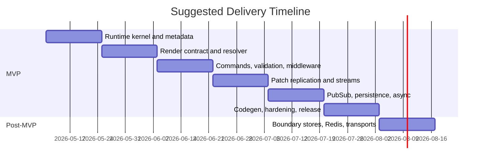

# Arbor — PRD and Milestone Plan for a BEAM Hierarchical Store Runtime

## Executive Summary

Arbor is a server-authoritative, page-scoped runtime library for Elixir/Phoenix. A single BEAM process per connected page owns a dynamic hierarchical tree of stores, routes commands to addressed nodes, computes a structured render output per node, resolves child-store placeholders, validates the resolved output against a per-store schema, diffs it against the previous resolved output, and pushes RFC 6902 JSON Patch updates plus stream-op envelopes to the client. Internal implementation state lives in `ctx.assigns`; only the resolved render output is exposed to the client. The same per-store schema produces both Elixir typespecs and a TypeScript shape, so the wire contract is statically typed end-to-end.

The central design rule is:

```txt
state do = client-visible output shape of render/1
         = TypeScript type source
         = JSON Patch validation target

ctx.assigns = server-only implementation state (DB results, caches, AsyncResult, transient fields)
```

The runtime borrows semantics from `Phoenix.LiveView`, `Phoenix.LiveComponent`, `Phoenix.Component`, `Phoenix.PubSub`, `Plug.Builder`, `:telemetry`, and RFC 6902. It deliberately diverges from LiveView in three ways: (1) it renders a typed JSON shape, not HTML; (2) it splits state into a private `assigns` half and a public `state` half; (3) child stores are composed via explicit `child(...)` placeholders in `render/1`, not via templated tags.

The MVP includes: store metadata DSL (`attr`, `state`, `command`, `callback`, `subscribe`, `middleware`, `stream`, `async`), runtime kernel and lifecycle, command routing with payload validation, `ctx.assigns` mutation API, `child(...)` placeholder resolution, structural JSON Patch diffing, render-output schema validation middleware, same-user PubSub synchronization, snapshot persistence adapters, telemetry, authorization, devtools hooks, a reference WebSocket transport, **LiveView-parity streams** (`stream/4`, `stream_configure/3`, `stream_insert/4`, `stream_delete/3`, `stream_delete_by_dom_id/3`), **LiveView-parity async tasks** (`assign_async`, `start_async`, `cancel_async`, `handle_async`, `Arbor.AsyncResult`), and TypeScript codegen for state and command types. It explicitly excludes CRDTs, offline-first sync, event sourcing, multi-process child stores, and generalized UI composition.

## Product Definition

### Product statement

Arbor is a runtime library for Elixir/Phoenix applications that lets developers model page state as a hierarchical tree of stateful stores. Each connected page runs as exactly one runtime process; child stores are logical runtime nodes within that process, not standalone processes. The parent owns child lifecycle through its `render/1` and passes immutable attrs (including function-attr callbacks) downward via `child(...)` placeholders. Children mutate only their own `ctx.assigns` and communicate upward only through parent-provided function attrs. The resolved render output is the **only** thing exposed to the client.

### Goals

| Goal | Final decision |
|---|---|
| Single-process consistency | One runtime process per connected page/session |
| Public/private state split | `state do` declares the public render output shape; `ctx.assigns` holds private server-only state |
| Render contract | `render(ctx)` returns a value matching the `state do` schema; `child(...)` placeholders are resolved before validation/diffing |
| Explicit ownership | Parent passes attrs (data + function attrs) via `child(...)`; child can only mutate its own `ctx.assigns` |
| Familiar runtime feel | LiveView-style command/broadcast/async lifecycle; LiveComponent-style same-process child placement |
| Predictable side effects | Plug-like middleware with halting and ordered hooks |
| Addressable mutations | Commands route by node path plus command name |
| Efficient replication | RFC 6902 JSON Patch over a duplex transport, with versioning and resync |
| Stream support | LiveView-parity stream API; server holds dom_id index only, client owns values |
| Async tasks | LiveView-parity `assign_async`/`start_async`/`cancel_async` with `Arbor.AsyncResult` |
| Cross-runtime sync | Same-user topic broadcasts via `Phoenix.PubSub` |
| Recoverability | Snapshot persistence adapters (assigns + dom_id index), not event sourcing |
| Type safety | Generated Elixir typespecs and TypeScript types from one source of truth (`state do` and `command do`) |
| Observability | Telemetry events, tree snapshots, trace hooks, patch history |

### Non-goals

| Non-goal | Reason |
|---|---|
| One process per child store | Too much ordering, mailbox, and merge complexity for MVP |
| CRDT/offline-first | Large complexity increase with no MVP necessity |
| Event sourcing | Snapshot persistence is enough for this runtime layer |
| Templated UI composition (HEEx/JSX-style) | Render returns a typed JSON shape; layout belongs to the client |
| Slot composition | Children are placed by `child(...)` in `render/1`; slots are unnecessary |
| Automatic cross-store mutation graphs | Blurs ownership and makes behavior hard to reason about |
| Global selector graph / time travel | Useful later, not required for first usable system |
| Server-replayable stream history | Stream values are forgotten by design; resync uses `reload_stream/2` callback or full subtree replace |
| Async result persistence by default | Loading/failed states do not survive restart; only `ok?` results may opt in via `persist: :ok_only` |
| Untyped client wire | Only schema-validated output is allowed on the wire |

## Core Concepts

### Store

A store is a server-side runtime node that can:

- declare attrs received from its parent (`attr`)
- declare the public output shape (`state do`)
- declare client-callable commands (`command`)
- declare typed parent-callable callbacks (`callback`, sugar over function attrs)
- subscribe to PubSub topics (`subscribe`)
- mutate its own private `ctx.assigns`
- compose child stores via `child(...)` in `render/1`

A store has runtime identity within its parent: `(parent_path, module, id)`. The root page store is rooted at `[]`.

### `state do` — the public output shape

`state do` declares the shape returned by `render/1`. It is the only thing exposed to the client and the only thing diffed for JSON Patch generation. It is also the source of truth for both Elixir typespec and TypeScript codegen.

```elixir
defmodule CartStore do
  use Arbor.Store

  state do
    field :status, String.t()
    field :items, list(CartItemState.t())
    field :subtotal, MoneyState.t()
    field :error, map() | nil
  end
end
```

Generated Elixir type:

```elixir
@type state :: %{
  status: String.t(),
  items: list(CartItemState.t()),
  subtotal: MoneyState.t(),
  error: map() | nil
}
```

Generated TypeScript:

```ts
export type CartStoreState = {
  status: string
  items: CartItemState[]
  subtotal: MoneyState
  error: Record<string, unknown> | null
}
```

Supported field types: primitives (`String.t()`, `integer()`, `boolean()`, `float()`), `list(...)`, `map()`, nested `Arbor.State` modules (`MoneyState.t()`), nullable unions (`X | nil`), variants (`variant(...)`), `stream(...)` for stream-managed collections, and `AsyncResult.of(...)` for async-managed values.

`state do` does **not** declare internal local state. Internal state lives in `ctx.assigns`.

### `ctx.assigns` — private server-only state

Implementation details (DB rows, caches, transient flags, AsyncResult instances, callback closures resolved at runtime) live in `ctx.assigns`. They are never exposed to the client unless `render/1` explicitly maps them into the output shape.

```elixir
def mount(ctx) do
  {:ok,
   ctx
   |> assign(:filters, %{query: "", status: "all"})
   |> assign(:products, Catalog.list_products())}
end
```

### `render(ctx)` — produces the output shape

`render/1` returns a value matching the `state do` schema. It may return raw JSON-compatible data:

```elixir
def render(ctx) do
  %{
    status: ctx.assigns.status,
    error: ctx.assigns.error
  }
end
```

Or compose child stores via `child(...)` placeholders:

```elixir
def render(ctx) do
  %{
    cart: child(CartStore, id: "cart", cart_id: ctx.assigns.cart_id),
    notifications: child(NotificationStore, id: "notifications")
  }
end
```

`child(...)` is a runtime placeholder. The runtime walks the rendered structure, resolves each placeholder by mounting/updating the named child and calling its `render/1`, and substitutes the child output. Resolution is bottom-up; the outer store's output is finalized only after all child outputs are resolved.

### `child(...)` — runtime child store

Child stores exist **only** when produced by `child(...)` in some ancestor's `render/1`. There is no separate registration step.

```txt
field          = output data shape
child(...)     = runtime child store with its own assigns, attrs, lifecycle
```

`child(Module, id: "...", attr_key: value, ...)` creates or reuses the child node identified by `(parent_path, Module, id)`. Reusing the same identity across renders preserves the child's `assigns`. Removing it from `render/1` triggers `unmount/2`. Function-attr callbacks are passed via `callback(:name)` references (or arbitrary `fn` values) inside `child(...)`.

### `attr` — inputs from parent

`attr` declares typed inputs received from the parent.

```elixir
defmodule HeaderStore do
  use Arbor.Store

  attr :current_user, User.t(), required: true

  state do
    field :user_name, String.t()
    field :avatar_url, String.t() | nil
  end
end
```

Attrs are not part of the output unless `render/1` maps them into the output shape. Attrs include data attrs and **function attrs** (callbacks).

### Function attrs / callbacks

Children do not mutate parents. Children invoke parent-provided function attrs.

The underlying mechanism is always a function attr:

```elixir
attr :on_select, function(%{id: String.t()}, any()), required: true
```

For ergonomics and codegen, `callback name do payload ... end` is sugar that declares a typed function attr with a payload schema:

```elixir
callback :on_change do
  payload :query, String.t()
  payload :status, String.t()
end
```

Both forms produce a function attr that is:

- declared in the store's metadata
- passed by the parent through `child(...)` (often via a `callback(:handler_name)` shorthand that resolves to a function pointing at the parent's `handle_callback/3`)
- runtime-validated for presence and arity
- excluded from the `state do` output shape and from generated client TypeScript state types
- included in generated server-side helper types when useful for documentation

The child invokes a callback via `invoke/3`:

```elixir
def handle_command(:select, _payload, ctx) do
  {:ok, invoke(ctx, :on_select, %{id: ctx.attrs.product.id})}
end
```

The parent receives the call in `handle_callback/3`:

```elixir
def handle_callback(:product_selected, %{id: id}, ctx) do
  {:ok, assign(ctx, :selected_product_id, id)}
end
```

### `command` — client-callable commands

`command` declares the client-callable command surface and payload schema. Payload schemas support primitives, maps, lists, nested state objects, and variants.

```elixir
command :select_product do
  payload :id, String.t()
end

command :apply_filters do
  payload :query, String.t()
  payload :sort, SortState.t()
  payload :price_range, PriceRangeState.t() | nil
  payload :tags, list(String.t())
  payload :status, variant(
    active: %{},
    archived: %{},
    custom: %{value: String.t()}
  )
end
```

Generated TypeScript:

```ts
export type ProductPageStoreCommands = {
  select_product: {
    id: string
  }

  apply_filters: {
    query: string
    sort: SortState
    price_range: PriceRangeState | null
    tags: string[]
    status:
      | { status: "active" }
      | { status: "archived" }
      | { status: "custom"; value: string }
  }
}
```

### `middleware`

Middleware applies to mount, command, render, persistence, and terminate. Examples:

```elixir
middleware Arbor.Middleware.Logger
middleware Arbor.Middleware.ValidateRender
middleware {Arbor.Middleware.Persistence, key: :session}
middleware {Arbor.Middleware.Authorize, ability: :checkout}
```

`Arbor.Middleware.ValidateRender` is a recommended built-in: it validates each store's resolved render output against its `state do` schema before the diff engine runs. In `:dev` and `:test` it is on by default; in `:prod` it can be downgraded to telemetry-only.

### `subscribe` / `broadcast` — PubSub

Stores can declare topic subscriptions:

```elixir
subscribe fn ctx ->
  ["user:#{ctx.attrs.current_user.id}:notifications"]
end
```

And handle inbound broadcasts:

```elixir
def handle_broadcast("notifications.updated", %{unread_count: count}, ctx) do
  {:ok, assign(ctx, :unread_count, count)}
end
```

Stores broadcast outward via `broadcast/4` on `ctx`:

```elixir
ctx
|> assign(:unread_count, 0)
|> broadcast(
  "user:#{ctx.attrs.current_user.id}:notifications",
  "notifications.updated",
  %{unread_count: 0}
)
```

The runtime tags broadcasts with `origin_page_id` and uses `Phoenix.PubSub.broadcast_from` so the originator does not echo to itself. The runtime subscribes once per topic per page process.

### State object modules — `Arbor.State`

`Arbor.State` modules declare reusable output types. They are not stores: no commands, no attrs, no lifecycle, no PubSub, no runtime identity.

```elixir
defmodule MoneyState do
  use Arbor.State

  state do
    field :amount, integer()
    field :currency, String.t()
    field :formatted, String.t()
  end

  def from(%Money{} = money) do
    %{
      amount: money.amount,
      currency: money.currency,
      formatted: Money.format(money)
    }
  end
end
```

State modules participate in TypeScript codegen and Elixir typespec generation, but they cannot be referenced by `child(...)`.

### Important design boundary

```txt
Arbor.State module = reusable output type
Arbor.Store module = runtime node with commands, lifecycle, render
```

```elixir
field :price, MoneyState.t()    # plain output structure reuse
child(CartStore, id: "cart")    # runtime child store
```

## Architecture Overview

### Core runtime components

| Component | Responsibility |
|---|---|
| Page Runtime | Owns the root store tree, message loop, versioning, subscriptions, and transport session |
| Store Metadata Registry | Holds compile-time declarations: `attr`, `state`, `command`, `callback`, `middleware`, `subscribe`, `stream`, `async` |
| Render Resolver | Walks the value returned by `render/1`, resolves `child(...)` placeholders bottom-up, and produces the final concrete output |
| Render Validator | Validates each store's resolved output against its `state do` schema (via middleware) |
| Reconciler | Maintains `(parent_path, module, id)` identity for child nodes and preserves their `assigns` across renders |
| Command Router | Resolves `{path, command}` to a node, validates payload against schema, invokes middleware and handler |
| Middleware Runner | Executes ordered hooks around mount, command, render, persistence, and terminate |
| Diff Engine | Produces RFC 6902 JSON Patch ops from previous resolved output to next resolved output |
| Stream Manager | Tracks per-store stream config and dom_id key sets, accumulates `stream_ops` per cycle, drops values after flush |
| Async Supervisor | Runtime-scoped `Task.Supervisor`; tracks refs, routes results to `assign_async` writers or `handle_async/4`; cancels on unmount |
| Transport Adapter | Sends patches and stream ops to the client; receives commands and acks |
| PubSub Bridge | Tracks topic subscriptions and routes broadcasts into the tree |
| Persistence Adapter | Loads and saves snapshot state (`assigns` + dom_id index) for the runtime tree |
| Codegen | Emits Elixir typespecs and TypeScript types from `state do` and `command do` declarations |
| Devtools/Trace | Exposes introspection: tree shape, last command, last patch, async refs, stream counters, timings |

### Data flow

**Command flow**

```
client command
  -> payload validation against command schema
  -> before_command middleware
  -> handle_command(name, payload, ctx) -> mutates ctx.assigns
  -> root render(ctx)
  -> resolve child(...) placeholders bottom-up
  -> ValidateRender middleware (per store)
  -> diff previous resolved output vs next resolved output (JSON Patch)
  -> pack stream_ops accumulated this cycle
  -> after_command middleware
  -> transport push (versioned envelope)
  -> optional snapshot save (debounced)
```

**Broadcast flow**

```
PubSub message
  -> topic router
  -> handle_broadcast on each subscribed store
  -> root render -> resolve -> validate -> diff -> push
```

**Async flow**

```
handler calls assign_async/start_async
  -> Task spawned under Async Supervisor
  -> immediate flush of "loading" AsyncResult patch
  -> task completes
  -> {ref, result} routed to assign_async writer or handle_async/4
  -> root render -> resolve -> validate -> diff -> push
```

**Stream flow**

```
handler calls stream/stream_insert/stream_delete/stream_configure
  -> stream ops accumulated by Stream Manager
  -> render proceeds with stream-typed fields opaque to JSON Patch
  -> patch envelope packs ops + stream_ops
  -> transport push
  -> server drops stream values, retains dom_id index
```

**Recovery flow**

```
runtime start
  -> optional snapshot load (assigns + dom_id index)
  -> root mount -> root render -> resolve -> validate
  -> async tasks restarted by mount as needed
  -> streams re-seeded by mount or reload_stream/2
  -> subscribe topics
  -> ready
```

### Transport and patching

The wire format is transport-agnostic with a reference WebSocket adapter for MVP. All client-visible updates are versioned and emitted as RFC 6902 JSON Patch arrays alongside an ordered `stream_ops` list. For MVP, JSON Patch ops are limited to `add`, `remove`, and `replace`; `move`, `copy`, and `test` are out of scope. JSON Patch paths are JSON Pointers into the resolved root output (`/cart/items/0/title`, `/notifications/unread_count`).

Example envelopes:

```json
{
  "type": "command",
  "path": [],
  "command": "select_product",
  "payload": {"id": "prod_123"},
  "client_seq": 17
}
```

```json
{
  "type": "command",
  "path": ["filters"],
  "command": "change_query",
  "payload": {"query": "shirt"},
  "client_seq": 18
}
```

```json
{
  "type": "patch",
  "base_version": 41,
  "version": 42,
  "ops": [
    {"op": "replace", "path": "/selected_product_id", "value": "prod_123"},
    {"op": "replace", "path": "/products/3/selected", "value": true}
  ],
  "stream_ops": []
}
```

```json
{
  "type": "patch",
  "base_version": 42,
  "version": 43,
  "ops": [],
  "stream_ops": [
    {"op": "configure", "path": ["chat"], "stream": "messages", "dom_id_prefix": "msg-"},
    {"op": "reset",     "path": ["chat"], "stream": "messages"},
    {"op": "insert",    "path": ["chat"], "stream": "messages",
     "dom_id": "msg-7", "at": 0, "limit": -100, "data": {"id": 7, "body": "hi"}},
    {"op": "delete",    "path": ["chat"], "stream": "messages", "dom_id": "msg-3"}
  ]
}
```

```json
{
  "type": "command",
  "path": ["chat"],
  "command": "request_stream_reload",
  "payload": {"stream": "messages"},
  "client_seq": 91
}
```

If the client misses a patch or the version check fails, the runtime sends a full snapshot replace for the affected subtree or the whole page. For streams, the runtime invokes `reload_stream/2` if defined, otherwise falls back to subtree replace.

## Programming Model and API

### API surface

| Surface | Purpose | Final rule |
|---|---|---|
| `use Arbor.Store` | Marks a module as a store | Required |
| `use Arbor.State` | Marks a module as a reusable state object type | Required for `Arbor.State` modules |
| `attr name, type, opts` | Declares parent-provided attrs (data or function) | Required for all external inputs |
| `state do ... end` | Declares the public output shape | Validated against `render/1` output |
| `field name, type, opts` | Declares one field in `state do` | Supports `stream(...)` and `AsyncResult.of(...)` types |
| `callback name do payload ... end` | Sugar for a typed function attr | Desugars to an `attr name, function(...)` |
| `command name do payload ... end` | Declares client-callable command and payload schema | Runtime-validated |
| `middleware ...` | Attaches middleware modules | Root and/or store-local |
| `subscribe fun_or_list` | Declares PubSub topics | Function form receives `ctx` for topic templating |
| `stream name, opts` | Declares stream metadata (`:dom_id`, `:limit`) | Compile-time fixed; values not persisted |
| `async name, opts` | Declares named async task slot | Optional sugar over `start_async/3,4` |
| `mount(ctx)` | Initializes `ctx.assigns` on first insertion | Called once per `(parent_path, module, id)` |
| `update(ctx)` | Reacts to attr changes from the parent | Called when attrs change meaningfully |
| `handle_command(name, payload, ctx)` | Handles addressed client command | Returns `{:ok, ctx}` or `{:error, reason}` |
| `handle_callback(name, payload, ctx)` | Handles upward callback invocation from a child | Returns `{:ok, ctx}` |
| `handle_broadcast(event, payload, ctx)` | Handles PubSub event | Optional |
| `handle_async(name, result, ctx)` | Handles async task completion | Required when `start_async` is used |
| `reload_stream(name, ctx)` | Re-seeds a stream during resync | Optional; required for stream resync without subtree replace |
| `render(ctx)` | Produces the public output shape | Required |
| `unmount(reason, ctx)` | Final cleanup hook | Optional |

### `ctx` API

| Function | Purpose |
|---|---|
| `assign(ctx, key, value)` / `assign(ctx, kw_or_map)` | Set values in `ctx.assigns` |
| `update_assign(ctx, key, fun)` | Functionally update an assign |
| `invoke(ctx, callback_name, payload)` | Call a parent-provided function attr |
| `child(Module, opts)` | Render-time placeholder for a child store (only valid in `render/1`) |
| `callback(name)` | Render-time helper that produces a function attr value pointing at `handle_callback/3` |
| `broadcast(ctx, topic, event, payload)` | Publish to PubSub (uses `broadcast_from`) |
| `stream/4`, `stream_configure/3`, `stream_insert/4`, `stream_delete/3`, `stream_delete_by_dom_id/3` | LiveView-parity stream API |
| `assign_async(ctx, key_or_keys, fun, opts)` | Spawn async task; result wrapped as `AsyncResult` |
| `start_async(ctx, name, fun, opts)` | Spawn named async task; result routes to `handle_async/3` |
| `cancel_async(ctx, name_or_key, reason)` | Cancel an in-flight task |
| `persist_now(ctx)` | Force a synchronous snapshot save |

### Render contract — runtime rules

1. `state do` defines the resolved output shape.
2. `render(ctx)` must return a value structurally matching that shape, with `child(...)` placeholders permitted at any depth.
3. The runtime resolves `child(...)` placeholders bottom-up before validation and diffing.
4. `ValidateRender` middleware checks each store's resolved output against its `state do` schema.
5. JSON Patch is generated from the previous resolved root output to the next resolved root output.
6. Internal implementation state lives in `ctx.assigns`, the database, caches, async tasks, PubSub, or other backend mechanisms.
7. Only the resolved render output is exposed to the client.
8. `child(Module, id: ..., ...)` reuses the existing child node when `(parent_path, Module, id)` matches; otherwise a fresh child is mounted. A removed `child(...)` triggers `unmount/2` on the disappearing node.

### Command return contract

`handle_command/3`, `handle_callback/3`, `handle_broadcast/3`, and `handle_async/3` all return:

```elixir
{:ok, ctx}
{:ok, ctx, effects: [...]}
{:error, reason}
```

Stream and async APIs are direct transformations on `ctx` rather than effects; this keeps them composable and observable to middleware via the updated context. Supported MVP effects:

- `{:broadcast, topic, event, payload}`
- `{:reply, payload}`
- `{:persist_now}`

### Middleware

The middleware model is runtime Plug-like: ordered, halting, and explicit. Hooks operate on the store runtime context rather than `Plug.Conn`.

```elixir
defmodule Arbor.Middleware do
  @callback init(opts) :: opts

  @callback before_mount(ctx) :: {:cont, ctx} | {:halt, term}

  @callback before_command(path, command, payload, ctx) ::
              {:cont, payload, ctx} | {:halt, term}

  @callback after_render(path, resolved_output, ctx) ::
              {:cont, resolved_output, ctx} | {:halt, term}

  @callback after_command(path, command, old_output, new_output, patch, ctx) ::
              {:cont, patch, ctx} | {:halt, term}

  @callback terminate(reason, runtime, ctx) :: :ok
end
```

Recommended built-ins:

- `Arbor.Middleware.Logger`
- `Arbor.Middleware.ValidateRender` (default-on in dev/test; telemetry-only in prod)
- `Arbor.Middleware.Authorize`
- `Arbor.Middleware.Persistence`
- `Arbor.Middleware.RateLimit`

## Complete Example

### Root page store

```elixir
defmodule MyApp.Stores.ProductPageStore do
  use Arbor.Store

  state do
    field :header, HeaderStore.state()
    field :filters, FilterStore.state()
    field :products, list(ProductCardStore.state())
    field :selected_product_id, String.t() | nil
    field :notifications, NotificationStore.state()
  end

  command :select_product do
    payload :id, String.t()
  end

  command :reload_products do
  end

  middleware Arbor.Middleware.Logger
  middleware Arbor.Middleware.ValidateRender
  middleware {Arbor.Middleware.Persistence, key: :session}

  def mount(ctx) do
    products = Catalog.list_products()

    {:ok,
     ctx
     |> assign(:current_user, ctx.session.current_user)
     |> assign(:products, products)
     |> assign(:selected_product_id, nil)
     |> assign(:filters, %{query: "", status: "all"})}
  end

  def handle_command(:select_product, %{id: id}, ctx) do
    {:ok, assign(ctx, :selected_product_id, id)}
  end

  def handle_command(:reload_products, _payload, ctx) do
    products = Catalog.list_products(ctx.assigns.filters)
    {:ok, assign(ctx, :products, products)}
  end

  def render(ctx) do
    %{
      header:
        child(HeaderStore,
          id: "header",
          current_user: ctx.assigns.current_user
        ),
      filters:
        child(FilterStore,
          id: "filters",
          filters: ctx.assigns.filters,
          on_change: callback(:filters_changed)
        ),
      products:
        for product <- ctx.assigns.products do
          child(ProductCardStore,
            id: product.id,
            product: product,
            selected: product.id == ctx.assigns.selected_product_id,
            on_select: callback(:product_selected)
          )
        end,
      selected_product_id: ctx.assigns.selected_product_id,
      notifications:
        child(NotificationStore,
          id: "notifications",
          current_user: ctx.assigns.current_user
        )
    }
  end

  def handle_callback(:filters_changed, filters, ctx) do
    products = Catalog.list_products(filters)

    {:ok,
     ctx
     |> assign(:filters, filters)
     |> assign(:products, products)}
  end

  def handle_callback(:product_selected, %{id: id}, ctx) do
    {:ok, assign(ctx, :selected_product_id, id)}
  end
end
```

### HeaderStore

```elixir
defmodule MyApp.Stores.HeaderStore do
  use Arbor.Store

  attr :current_user, User.t(), required: true

  state do
    field :user_name, String.t()
    field :avatar_url, String.t() | nil
  end

  def render(ctx) do
    user = ctx.attrs.current_user

    %{
      user_name: user.name,
      avatar_url: user.avatar_url
    }
  end
end
```

### FilterStore

```elixir
defmodule MyApp.Stores.FilterStore do
  use Arbor.Store

  attr :filters, map(), required: true

  callback :on_change do
    payload :query, String.t()
    payload :status, String.t()
  end

  state do
    field :query, String.t()
    field :status, String.t()
    field :dirty, boolean()
  end

  command :change_query do
    payload :query, String.t()
  end

  command :change_status do
    payload :status, String.t()
  end

  def mount(ctx), do: {:ok, assign(ctx, :dirty, false)}

  def handle_command(:change_query, %{query: query}, ctx) do
    filters = %{ctx.attrs.filters | query: query}

    {:ok,
     ctx
     |> assign(:dirty, true)
     |> invoke(:on_change, filters)}
  end

  def handle_command(:change_status, %{status: status}, ctx) do
    filters = %{ctx.attrs.filters | status: status}

    {:ok,
     ctx
     |> assign(:dirty, true)
     |> invoke(:on_change, filters)}
  end

  def render(ctx) do
    %{
      query: ctx.attrs.filters.query,
      status: ctx.attrs.filters.status,
      dirty: ctx.assigns.dirty || false
    }
  end
end
```

### ProductCardStore

```elixir
defmodule MyApp.Stores.ProductCardStore do
  use Arbor.Store

  attr :product, Product.t(), required: true
  attr :selected, boolean(), default: false

  callback :on_select do
    payload :id, String.t()
  end

  state do
    field :id, String.t()
    field :title, String.t()
    field :price, MoneyState.t()
    field :image_url, String.t() | nil
    field :selected, boolean()
    field :status, String.t()
  end

  command :select do
  end

  def handle_command(:select, _payload, ctx) do
    {:ok, invoke(ctx, :on_select, %{id: ctx.attrs.product.id})}
  end

  def render(ctx) do
    product = ctx.attrs.product

    %{
      id: product.id,
      title: product.title,
      price: MoneyState.from(product.price),
      image_url: product.image_url,
      selected: ctx.attrs.selected,
      status: product.status
    }
  end
end
```

### NotificationStore

```elixir
defmodule MyApp.Stores.NotificationStore do
  use Arbor.Store

  attr :current_user, User.t(), required: true

  state do
    field :unread_count, integer()
    field :latest, list(NotificationState.t())
  end

  subscribe fn ctx ->
    ["user:#{ctx.attrs.current_user.id}:notifications"]
  end

  command :mark_all_read do
  end

  def mount(ctx) do
    notifications = Notifications.latest(ctx.attrs.current_user.id)

    {:ok,
     ctx
     |> assign(:unread_count, Notifications.unread_count(ctx.attrs.current_user.id))
     |> assign(:latest, notifications)}
  end

  def handle_command(:mark_all_read, _payload, ctx) do
    Notifications.mark_all_read(ctx.attrs.current_user.id)

    {:ok,
     ctx
     |> assign(:unread_count, 0)
     |> broadcast(
       "user:#{ctx.attrs.current_user.id}:notifications",
       "notifications.updated",
       %{unread_count: 0}
     )}
  end

  def handle_broadcast("notifications.updated", %{unread_count: count}, ctx) do
    {:ok, assign(ctx, :unread_count, count)}
  end

  def render(ctx) do
    %{
      unread_count: ctx.assigns.unread_count || 0,
      latest: Enum.map(ctx.assigns.latest || [], &NotificationState.from/1)
    }
  end
end
```

### State object modules

```elixir
defmodule MoneyState do
  use Arbor.State

  state do
    field :amount, integer()
    field :currency, String.t()
    field :formatted, String.t()
  end

  def from(%Money{} = money) do
    %{
      amount: money.amount,
      currency: money.currency,
      formatted: Money.format(money)
    }
  end
end

defmodule NotificationState do
  use Arbor.State

  state do
    field :id, String.t()
    field :title, String.t()
    field :read, boolean()
    field :inserted_at, String.t()
  end

  def from(notification) do
    %{
      id: notification.id,
      title: notification.title,
      read: notification.read,
      inserted_at: DateTime.to_iso8601(notification.inserted_at)
    }
  end
end
```

## Runtime Semantics and Operations

### State ownership and lifecycle

A store node is identified by `(parent_path, module, id)`. Within one parent, keyed reordering preserves the child's `assigns`. Moving a node to a different parent remounts it. The root page store is rooted at `[]`.

Lifecycle rules:

- `mount(ctx)` runs when a node identity first appears. Initialize `ctx.assigns` here.
- `update(ctx)` runs when attrs change meaningfully.
- `render(ctx)` runs after mount, after update, and after every successful command/broadcast/async/stream handler.
- `handle_callback(name, payload, ctx)` runs when a child invokes a function-attr callback.
- `unmount(reason, ctx)` runs when a node disappears from its parent's `render/1`. All async tasks owned by the node are cancelled with `{:exit, :unmount}`. The node's stream dom_id index is dropped. Its `assigns` is freed.
- Root `terminate(reason, runtime)` runs when the page runtime exits. The Async Supervisor terminates all child tasks.
- Children **cannot** mutate parent or sibling `assigns` directly.

### Reconciliation

Reconciliation is root-driven. After a successful command, broadcast, or async result, the runtime rerenders the root, walks the returned structure, resolves `child(...)` placeholders using `(parent_path, module, id)` identity, and validates each store's output. The Diff Engine then computes RFC 6902 JSON Patch ops between the previous resolved output and the next resolved output.

Rules:

- Identity preservation: nodes with identical `(parent_path, module, id)` keep their `assigns`.
- Remount on module change, parent change, or id change.
- Keyed lists: the position of a child inside its parent's output is determined by `render/1`. The runtime preserves child `assigns` across reorders by `(parent_path, module, id)`, regardless of array index.
- JSON Patch ops are limited to `add`, `remove`, `replace` for MVP.
- Subtree-level `replace` is the safe fallback when fine-grained diffing is not worth the complexity.
- Stream-typed fields (`field :name, stream(T.t())`) are **opaque to JSON Patch**: the runtime never diffs them as JSON arrays; they are transmitted only via `stream_ops`.

### Streams

Streams mirror `Phoenix.LiveView` stream semantics: the server emits ordered insert/delete/reset operations to the client and **does not retain item values**. The client owns the materialized list.

#### Declaration

```elixir
defmodule MessagesStore do
  use Arbor.Store

  attr :room_id, :string, required: true

  state do
    field :messages, stream(MessageState.t())
  end

  stream :messages,
    dom_id: &"msg-#{&1.id}",
    limit: -100

  def mount(ctx) do
    msgs = Chat.recent(ctx.attrs.room_id, 50)
    {:ok, ctx |> stream(:messages, msgs)}
  end

  def handle_broadcast("msg:new", msg, ctx),
    do: {:ok, ctx |> stream_insert(:messages, msg, at: 0, limit: -100)}

  def handle_command(:delete, %{id: id}, ctx),
    do: {:ok, ctx |> stream_delete_by_dom_id(:messages, "msg-#{id}")}

  def reload_stream(:messages, ctx) do
    {:ok, Chat.recent(ctx.attrs.room_id, 50)}
  end

  def render(_ctx) do
    %{messages: stream_field(:messages)}
  end
end
```

`stream_field(:name)` is a render-time helper that emits a placeholder for the runtime to recognize the stream-typed field; it produces no value on the wire (the client materializes the array from `stream_ops`).

#### API parity

| Function | Behavior |
|---|---|
| `stream(ctx, name, items, opts)` | Seed; with `reset: true`, emits `reset` op then re-seeds |
| `stream_configure(ctx, name, opts)` | Must run before `stream/4`; sets `:dom_id` and defaults |
| `stream_insert(ctx, name, item, opts)` | Upsert by dom_id; supports `:at`, `:limit` |
| `stream_delete(ctx, name, item)` | Delete by computed dom_id from item |
| `stream_delete_by_dom_id(ctx, name, dom_id)` | Delete by literal dom_id |

Supported options (parity with LiveView):

- `:at` — `-1` append (default), `0` prepend, positive integer = insert at index.
- `:limit` — positive `N` keep first N, negative `-N` keep last N; runtime applies after each insert.
- `:reset` — clear stream before applying seed list.
- `:dom_id` — `(item -> binary)` function; configured via `stream_configure/3` or `stream/4` opts.

#### Server memory model

- Values are not retained after stream ops are flushed to the wire.
- The runtime keeps an optional ordered `MapSet`/list of dom_ids per stream for `:limit` enforcement, dedup detection on upsert, and key-only persistence.
- Stream metadata (`:dom_id` function, `:limit`) is fixed at compile time.

#### Resync

1. **`reload_stream/2` callback** (preferred): runtime invokes the store's `reload_stream/2`, then issues a `stream(reset: true)` with the returned items.
2. **Client-initiated `:request_stream_reload`** system command routes to the owning node's `reload_stream/2`. Without `reload_stream/2`, the runtime falls back to a full subtree snapshot replace.

#### Persistence

Stream values are never persisted. The dom_id index may optionally be persisted to restore `:limit` accounting after restart; values must be re-fetched during `mount` or `reload_stream/2`.

### Async tasks

Async support mirrors `Phoenix.LiveView` async semantics with full API parity, anchored on a runtime-scoped `Task.Supervisor` and the `Arbor.AsyncResult` struct.

#### `Arbor.AsyncResult`

```elixir
%Arbor.AsyncResult{
  loading: term | nil,
  ok?: boolean,
  result: term | nil,
  failed: term | nil
}

Arbor.AsyncResult.loading()
Arbor.AsyncResult.loading(meta)
Arbor.AsyncResult.ok(prior, value)
Arbor.AsyncResult.failed(prior, reason)
```

`AsyncResult` values are normal data and serialize through JSON Patch like any other field. The state shape declares them as `field :name, AsyncResult.of(InnerType.t())`, which generates a TypeScript discriminated-union type.

#### API parity

| Function | Behavior |
|---|---|
| `assign_async(ctx, key_or_keys, fun, opts)` | Spawn task; on `{:ok, %{key => val, ...}}` write `AsyncResult.ok/2` to assigns; on error write `AsyncResult.failed/2` |
| `start_async(ctx, name, fun, opts)` | Spawn named task; route `{:ok, val}` / `{:exit, reason}` to `handle_async(name, result, ctx)` |
| `cancel_async(ctx, name_or_key, reason)` | Terminate task; final state is `failed: {:exit, reason}` |
| `handle_async(name, result, ctx)` | Required when `start_async/3,4` is used |

Supported options (parity with LiveView):

- `:supervisor` — override the default per-runtime `Task.Supervisor`.
- `:timeout` — coerce overdue tasks into `failed: :timeout`.
- `:reset` — for `assign_async`, cancel the prior task for the same key and re-emit `loading` state.

#### Lifecycle and cancellation rules

| Event | Behavior |
|---|---|
| `assign_async(reset: true)` | Cancel prior task for same key; emit `loading{prior_meta}` patch; spawn new task |
| Multiple in-flight tasks per node | Allowed; tracked by ref keyed on `{node_path, name_or_keys}` |
| Node unmount | All owned tasks cancelled with `{:exit, :unmount}`; no resulting patch |
| Runtime terminate | Async Supervisor terminates all children; no orphan tasks |
| Timeout fires | Runtime calls `Task.Supervisor.terminate_child/2`; result recorded as `failed: :timeout` |
| Task crashes (`{:DOWN, ref, :process, _, reason}`) | `failed: {:exit, reason}` |

#### Failure classification

| Task return | `AsyncResult` terminal state |
|---|---|
| `{:ok, val}` (assign_async fun) | `ok?: true, result: val` |
| `{:error, reason}` (assign_async fun) | `failed: {:error, reason}` |
| Raised exception / exit | `failed: {:exit, reason}` |
| Timeout | `failed: :timeout` |
| `cancel_async/3` | `failed: {:exit, :cancel}` |

#### Persistence

Loading and failed states are not persisted by default. Stores opt in to persisting only successful results via `async :name, persist: :ok_only`.

#### Resync

The runtime retains the current `AsyncResult` (not the in-flight task). Resync replays the latest snapshot. In-flight tasks at disconnect time remain in-flight; their completion produces a normal patch on the next render cycle.

#### Example

```elixir
defmodule UserProfileStore do
  use Arbor.Store

  attr :user_id, :string, required: true

  state do
    field :profile, AsyncResult.of(UserProfileState.t())
  end

  def mount(ctx) do
    ctx =
      ctx
      |> assign(:profile, Arbor.AsyncResult.loading())
      |> assign_async(:profile, fn -> {:ok, %{profile: Users.fetch!(ctx.attrs.user_id)}} end)
      |> start_async(:warm_cache, fn -> Cache.warm(ctx.attrs.user_id) end, timeout: 5_000)

    {:ok, ctx}
  end

  def handle_async(:warm_cache, {:ok, _}, ctx), do: {:ok, ctx}
  def handle_async(:warm_cache, {:exit, reason}, ctx) do
    Logger.warning("cache warm failed: #{inspect(reason)}")
    {:ok, ctx}
  end

  def handle_command(:reload, _, ctx) do
    ctx =
      assign_async(ctx, :profile,
        fn -> {:ok, %{profile: Users.fetch!(ctx.attrs.user_id)}} end,
        reset: true)

    {:ok, ctx}
  end

  def render(ctx) do
    %{profile: ctx.assigns.profile}
  end
end
```

### PubSub model and persistence

`Phoenix.PubSub` provides topic subscription and cluster broadcast for cross-page or cross-tab same-user sync. The runtime subscribes once per topic per page process. For same-user sync, use topics like `user:<id>`. `broadcast_from` excludes the originator.

Snapshot persistence is the persistence model for MVP. The persistence unit is the whole page runtime tree snapshot: each store's `assigns` plus its stream dom_id index. The resolved output is **not** persisted (it is reproducible from `assigns` + `attrs` via `render/1`). Stream values and async loading/failed states are excluded from snapshots by default.

Recommended adapters:

- `ETS` for dev/test and single-node ephemeral use
- `Redis` for shared ephemeral state
- `Postgres` for durable JSON snapshot storage

```elixir
defmodule Arbor.Persistence do
  @callback load(key, meta) :: {:ok, snapshot} | :not_found | {:error, term}
  @callback save(key, snapshot, meta) :: :ok | {:error, term}
  @callback delete(key, meta) :: :ok | {:error, term}
end
```

Default persistence mode is debounced, post-commit save. Synchronous durability is opt-in via `persist_now/1` or middleware.

### Telemetry, security, devtools, and testing

Telemetry instruments mount, command, render, resolve, validate, diff, patch emission, persistence, PubSub receive/broadcast, async lifecycle, and stream flush.

| Event prefix | Measurements | Metadata |
|---|---|---|
| `[:arbor, :mount, :start|:stop|:exception]` | duration | page_id, root_module |
| `[:arbor, :command, :start|:stop|:exception]` | duration, patch_ops, stream_ops | page_id, path, command, user_id |
| `[:arbor, :render, :stop]` | duration, node_count | page_id |
| `[:arbor, :resolve, :stop]` | duration, child_count | page_id |
| `[:arbor, :validate, :stop|:exception]` | duration, errors | page_id, path |
| `[:arbor, :diff, :stop]` | duration, op_count | page_id |
| `[:arbor, :patch, :stop]` | duration, op_count, stream_op_count, bytes | page_id |
| `[:arbor, :persistence, :save, :stop|:exception]` | duration, bytes | key, adapter |
| `[:arbor, :pubsub, :receive]` | count | topic, event |
| `[:arbor, :auth, :deny]` | count | path, command, user_id |
| `[:arbor, :async, :start]` | — | page_id, path, name_or_keys |
| `[:arbor, :async, :stop]` | duration | page_id, path, name, status |
| `[:arbor, :async, :exception]` | duration | page_id, path, name, kind, reason |
| `[:arbor, :async, :cancel]` | — | page_id, path, name, reason |
| `[:arbor, :stream, :flush]` | op_count, dom_id_count | page_id, path, name |
| `[:arbor, :stream, :reload, :stop|:exception]` | duration, item_count | page_id, path, name |

Security and authorization are middleware-driven and default-deny. Command payloads are runtime-validated against the declared command schema before handler execution. Authorization runs in `before_command` middleware and may halt the pipeline. Function attrs are capabilities: if the parent does not pass a callback, the child cannot invoke it. PubSub broadcasts are scoped by topic authority.

Devtools expose:

- `Arbor.Dev.snapshot(pid)` — current tree, node paths, `assigns`/state sizes, subscriptions, version, active async refs, per-stream dom_id counts.
- `Arbor.Dev.last_patch(pid)` — last patch envelope.
- `Arbor.Dev.trace(pid, on: true)` — command, render, resolve, validate, async, stream tracing.
- A ring buffer of recent commands, broadcasts, async results, stream flushes, and persistence failures.
- `Arbor.Dev.cancel_async(pid, path, name)` test hook.

Testing layers:

- **Unit tests** for `mount`, `update`, `handle_command`, `handle_callback`, `handle_broadcast`, `handle_async`, `reload_stream`.
- **Render-output tests** comparing `render/1` output to expected JSON shape; parity with `state do` schema.
- **Resolver tests** for `child(...)` identity preservation across reorders, remounts on key/parent/module change, and subtree deletes.
- **Stream tests** for `:at`, `:limit`, `:reset`, upsert by dom_id, `reload_stream/2` round-trip, and dom_id key-only persistence.
- **Async tests** for happy path, error path, timeout, `:reset`, `cancel_async`, and unmount-cancel.
- **Golden patch tests** for RFC 6902 output and `stream_ops` ordering.
- **Codegen tests** for generated TypeScript and Elixir types.
- **Integration tests** with two page runtimes for same-user PubSub sync.
- **Persistence round-trip tests** for snapshot restore.
- **Failure tests** for unauthorized commands, middleware halts, stale command paths, version mismatch resync, missing `reload_stream/2`, async crash classification, orphan-task detection, and validate-render rejection.

## Frontend Usage

```ts
const store = arbor.connect<ProductPageStoreState, ProductPageStoreCommands>({
  store: "ProductPageStore",
  params: {}
})

store.subscribe((state) => {
  render(state)
})

store.command("select_product", { id: "prod_123" })
```

Nested command routing addresses the child path:

```ts
store.command(["filters"], "change_query", { query: "shirt" })
store.command(["products", "prod_123"], "select", {})
```

Patches arrive as RFC 6902 JSON Patch arrays plus an optional `stream_ops` list; the client merges them into its local copy of the resolved output and dispatches stream ops to materialize stream-typed fields.

## Generated TypeScript Shape

```ts
export type ProductPageStoreState = {
  header: HeaderStoreState
  filters: FilterStoreState
  products: ProductCardStoreState[]
  selected_product_id: string | null
  notifications: NotificationStoreState
}

export type ProductPageStoreCommands = {
  select_product: { id: string }
  reload_products: {}
}

export type FilterStoreState = {
  query: string
  status: string
  dirty: boolean
}

export type FilterStoreCommands = {
  change_query: { query: string }
  change_status: { status: string }
}

export type AsyncResult<T> = {
  loading: unknown | null
  ok: boolean
  result: T | null
  failed: unknown | null
}
```

## Delivery Roadmap

The roadmap prioritizes the runtime kernel, render contract, and resolver first, then command and middleware semantics, then replication and operational features. Streams ship in the patch milestone; async ships in the PubSub/persistence milestone; codegen ships in the hardening milestone.

### Milestones

| Milestone | Deliverables | Effort | Success criteria | Timeline |
|---|---|---|---|---|
| Runtime kernel and metadata | Root runtime process, `use Arbor.Store`, `use Arbor.State`, metadata registry, `attr/state/command/callback/middleware/subscribe/stream/async` declarations, `ctx` struct with `assign`/`update_assign`/`invoke`/`broadcast` | High | A root store mounts, holds `assigns`, executes a no-op command cycle, and produces a valid empty render output | Weeks 1–2 |
| Render contract and resolver | `child(...)` placeholder model, render-output resolver, `(parent_path, module, id)` identity, `assigns` preservation across reorders, mount/update/unmount lifecycle, render-output tests | High | Static, conditional, and keyed-list outputs all resolve correctly; reorders preserve child `assigns`; remount on module/parent/id change | Weeks 3–4 |
| Command routing, validation, middleware | Path-based routing, payload validation, Plug-like middleware hooks, `Arbor.Middleware.ValidateRender`, authorization middleware, function-attr callbacks, `request_stream_reload` system command | High | Commands route to correct nodes; payloads are validated; unauthorized commands halt cleanly; render output is validated; callbacks invoke parent handlers | Weeks 5–6 |
| Patch replication and streams | RFC 6902 diff engine, patch envelopes with `stream_ops`, versioning, resync path, full LiveView-parity stream API + `reload_stream/2`, stream-typed fields opaque to JSON Patch, reference WebSocket adapter | High | Client receives and applies json_patch + stream ops; version gaps trigger subtree replace or `reload_stream/2`; output passes golden tests | Weeks 7–8 |
| PubSub, persistence, and async | Subscription manager, same-user broadcast bridge, snapshot adapters (ETS + Postgres), full LiveView-parity async API + `Arbor.AsyncResult` + `Task.Supervisor` per runtime, `persist: :ok_only` opt-in | High | Two runtimes for the same user sync correctly; restored snapshots reconcile; async happy path, error path, timeout, `:reset`, unmount-cancel all behave LiveView-equivalent; no orphan tasks after runtime terminate | Weeks 9–10 |
| Codegen, hardening, and MVP release | Elixir typespec generation, TypeScript codegen, telemetry, devtools (async refs, stream counters), trace buffer, docs, examples, benchmarks, failure recovery | Medium | MVP acceptance criteria all pass; codegen is correct for primitives, lists, nested state, variants, streams, and `AsyncResult.of(...)`; benchmark envelope is acceptable | Weeks 11–12 |
| Post-MVP — Boundary stores and additional adapters | Optional scope/boundary stores, Redis persistence, additional transports | Medium | Boundary stores work without breaking ownership rules; Redis adapter passes round-trip tests | Weeks 13–14 |

### Suggested timeline



### Short implementation checklist

- Define core structs: `Runtime`, `Node`, `Context`, `PatchEnvelope`, `StreamOp`, `Arbor.AsyncResult`, `Arbor.Broadcast`.
- Implement `use Arbor.Store` and `use Arbor.State` with compile-time reflection for `attr`, `state`, `field`, `command`, `callback`, `middleware`, `subscribe`, `stream`, `async`.
- Implement `child(...)` placeholder, render-output resolver, and identity-preserving reconciler.
- Implement `ctx` API: `assign`, `update_assign`, `invoke`, `broadcast`, `persist_now`, plus stream and async helpers.
- Implement command router, payload schema validation, callback dispatch, system commands.
- Implement middleware runner with halting semantics; implement `Arbor.Middleware.ValidateRender`, `Logger`, `Authorize`, `Persistence`.
- Implement RFC 6902 diff engine and `stream_ops` packing.
- Implement Stream Manager: configure/insert/delete/reset/limit op accumulation, dom_id index, `reload_stream/2`, `:request_stream_reload`.
- Implement Async Supervisor: `Task.Supervisor` per runtime, ref tracking, `assign_async` writer, `start_async` dispatcher, `cancel_async`, `:timeout`, unmount-cancel, runtime-terminate sweep, `Arbor.AsyncResult` struct/helpers.
- Implement `Phoenix.PubSub` subscription diffing, same-user broadcast routing, stream-op broadcast carriage.
- Implement snapshot persistence adapters (ETS, Postgres), `persist: :ok_only` async opt-in, dom_id key-only stream persistence.
- Implement Elixir typespec emission and TypeScript codegen for `state do` and `command do`, including streams (`stream(T)` → `T[]`) and `AsyncResult.of(T)`.
- Implement telemetry, devtools, tests, docs, and a working example application matching the Complete Example section.

## Acceptance Criteria, Risks, and Mitigations

### MVP acceptance criteria

The MVP is done when all of the following are true:

- A connected page runs as exactly one runtime process.
- A store can declare `attr`, `state`, `command`, `callback`, `subscribe`, `middleware`, `stream`, and `async`.
- `state do` is the public output shape; internal state lives in `ctx.assigns` and is never sent to the client.
- `render(ctx)` returns a value matching `state do`, with `child(...)` placeholders permitted at any depth.
- The runtime resolves `child(...)` placeholders bottom-up, preserves child `assigns` by `(parent_path, module, id)` identity, and remounts on key/parent/module change.
- `Arbor.Middleware.ValidateRender` rejects render outputs that do not match the schema.
- Commands route by `{path, command}` to nested stores; unauthorized commands halt cleanly.
- Successful render cycles emit deterministic JSON Patch + `stream_ops` envelopes with monotonic versions.
- `stream/4`, `stream_configure/3`, `stream_insert/4`, `stream_delete/3`, `stream_delete_by_dom_id/3` behave equivalently to their `Phoenix.LiveView` counterparts, including `:at`, `:limit`, `:reset`, `:dom_id`, and upsert-by-dom_id semantics.
- A store implementing `reload_stream/2` recovers from version-mismatch resync without a full subtree replace; without it, the runtime falls back to a subtree replace.
- `assign_async/3,4`, `start_async/3,4`, `cancel_async/2,3`, and `handle_async/3` behave equivalently to their `Phoenix.LiveView` counterparts, including `:timeout`, `:reset`, automatic cancellation on unmount, and exit-reason classification on `AsyncResult`.
- The Async Supervisor leaves no orphan tasks after the runtime process terminates.
- Two runtimes for the same user sync through PubSub without duplicate reprocessing.
- Snapshot persistence restores `assigns` and dom_id index after restart. Stream values are not persisted by default; `AsyncResult` loading/failed are not persisted; `persist: :ok_only` is honored when set.
- Authorization middleware can halt commands cleanly.
- Telemetry and devtools expose mount, command, render, resolve, validate, diff, patch, broadcast, persistence, async, and stream visibility.
- Generated Elixir typespecs and TypeScript types match `state do` and `command do` declarations exactly, including streams (`stream(T)` → `T[]`) and `AsyncResult.of(T)`.
- The system runs without CRDTs, offline sync, or event sourcing.

### Key risks and trade-offs

| Risk | Trade-off | Mitigation and rollback |
|---|---|---|
| Single-process page may become a hotspot | Simplifies correctness; all child work shares one mailbox and heap | Keep page scope bounded; instrument mailbox/heap; avoid per-child processes in MVP |
| Render output schema validation cost | Validation in prod adds CPU per render | Default-on in dev/test; telemetry-only or opt-out in prod |
| Minimal diff generation expensive on big lists | Fine-grained patching may cost more than subtree replace | Permit subtree `replace` fallback; optimize keyed child diff later |
| Snapshot save adds latency or loses recent state | Sync save hurts UX; async save risks a small durability gap | Default debounced async save; opt-in sync via `persist_now/1` or middleware |
| PubSub feedback loops or duplicate events | Cross-runtime sync easy to misconfigure | `broadcast_from`, include `origin_page_id`, subscribe once per topic, drop self-origin echoes |
| Public/private state confusion | Devs may expect `state do` to drive internal state | Documentation, compile-time error on `assign`-into-state-field-name collisions, clear error messages |
| `child(...)` identity drift on key change | Forgetting `id:` causes remount and `assigns` loss | Compile-time error when `child(...)` lacks `id`; runtime warning when id is unstable across renders |
| Stream client drift after disconnect | Server cannot replay stream ops because values are dropped | Provide `reload_stream/2`; without it, fall back to subtree snapshot replace; telemetry on `[:arbor, :stream, :reload]` |
| Stream `:limit` and `:at` edge cases | Out-of-range `:at` or oscillating `:limit` can desync server index from client | Clamp `:at` to `[0, size]`; evaluate `:limit` after every insert; warn in dev when an op would be a no-op |
| Async orphan tasks | Tasks could outlive their owning node | Strict `Task.Supervisor` linkage; cancel on unmount; runtime-terminate sweep; devtools surfaces active refs |
| Async storm via repeated `:reset` | Rapid `assign_async(reset: true)` cascades cancel-and-spawn | Debounce loading-state emission per key; drop superseded results before patching; document latest-wins semantics |
| TypeScript codegen drift | TS types lagging Elixir schema causes runtime/wire mismatches | Codegen runs on every compile in dev; CI check fails build when TS output differs from committed artifacts |
| Stream broadcast amplification | Same-user PubSub fan-out for high-frequency streams can saturate the bus | Recommend coarse-grained topics, per-topic rate caps, batched stream ops in `after_command` middleware |

### Rollback strategy

- **First rollback:** ship MVP without `Arbor.Middleware.ValidateRender` enabled in prod (telemetry-only).
- **Second rollback:** downgrade from minimal patching to subtree `replace` patching.
- **Third rollback:** ship streams without `reload_stream/2` (full subtree replace on resync) and async without `persist: :ok_only`.
- **Fourth rollback:** ship only `ETS` and `Postgres` persistence adapters, defer Redis.
- **Fifth rollback:** ship Elixir typespec codegen but defer TypeScript codegen.
- **Never rollback:** single-process ownership model, public/private state split, `child(...)` identity model, command routing, middleware, PubSub same-user sync, stream API parity, async API parity, telemetry instrumentation.
